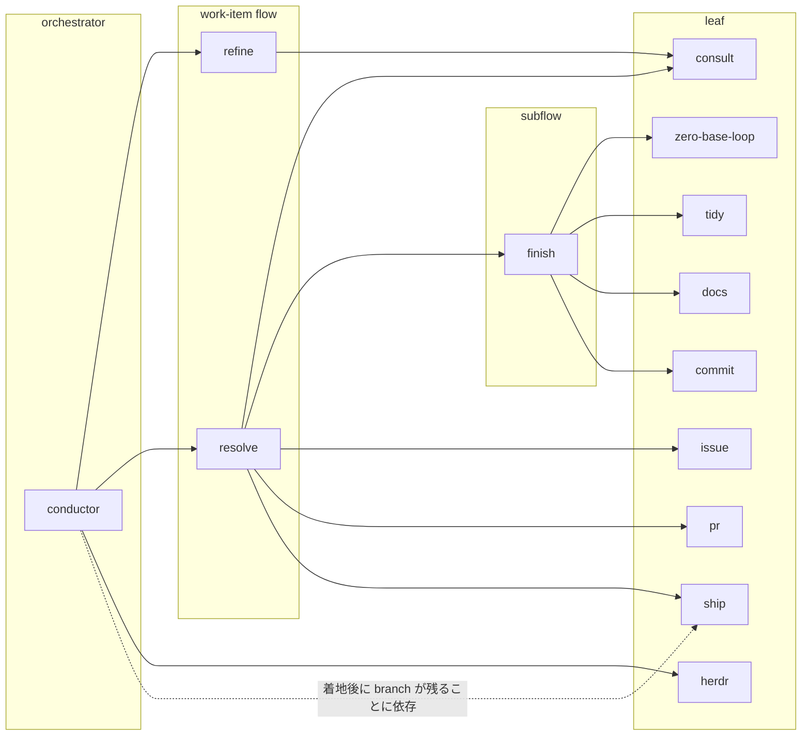
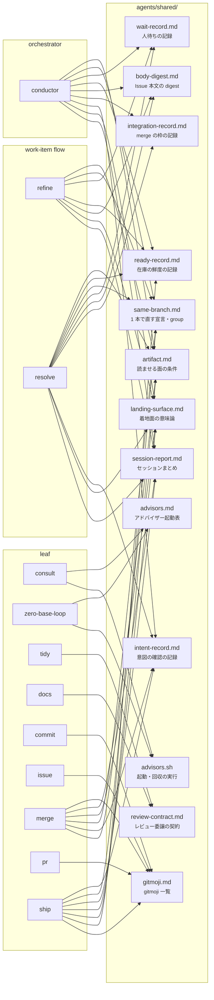

# ファイル構造と依存

規約の本体は各 `SKILL.md` と [`../../AGENTS.md`](../../AGENTS.md)（置き場所の判断と配線）。ここは実体の対応表。

## ディレクトリの役割

**`SKILL.md` 以外は、モデルがそのファイルに何をするかで置き場所が決まる**。大きさでは分けない。

| ディレクトリ                | モデルの扱い                                     | 投影先                        |
| --------------------------- | ------------------------------------------------ | ----------------------------- |
| `skills/<name>/SKILL.md`    | 発動時に**常に読む**                             | `~/.agents/skills/`           |
| `skills/<name>/references/` | **読む**（必要になったときだけ）                 | 同上                          |
| `skills/<name>/scripts/`    | **実行する**                                     | 同上                          |
| `skills/<name>/assets/`     | **成果物に使う**                                 | 同上                          |
| `AGENTS.md`                 | **常時読み込まれる**                             | `~/.agents/AGENTS.md` ほか    |
| `shared/`                   | **読む / 実行する**（skill から symlink 経由で） | skills の一部として投影される |
| `docs/`                     | **読まない**（人が読む）                         | 投影しない                    |

`SKILL.md` は発動時に常に読まれるので、**オンデマンドで足りるものは `references/` へ出す**。

## skill 間の参照

上位層 → 下位層の一方通行。同じ層への言及は作らない。**参照関係のあるものだけを描く**（leaf の全一覧は [`README.md`](README.md) の「層構造」）。

実線は起動、点線は挙動への依存。`conductor` が `ship` を名指しするのはこの 1 箇所だけで、起動はしない。

`conductor` が multiplexer の CLI を参照する箇所は **`references/harness.md` に隔離**してあり、本体はそれ以外の場所で multiplexer を知らない。

## 共有の実体

どの skill がどの共有実体を張っているか。**置く条件と張り方の規則は [`../../AGENTS.md`](../../AGENTS.md) が SSOT**。ここには写さない。

**shared が bare 名で参照する兄弟は、その shared を張った skill にも張る**。張らないと、読み手が
その名前を辿れない（同じ `references/` に在ることが bare 名の前提）。

**層をまたいでも、同じ層どうしでも、参照先は `shared/` だけ**。skill が別の skill の `references/` を覗く形が無くなるので、層契約（同じ層への言及を作らない）を隠さずに満たせる。

**skill 固有の reference は `references/` に実体で置く。**

| skill           | 実体                                                                                      | 何を持つか                                                                                                                                   |
| --------------- | ----------------------------------------------------------------------------------------- | -------------------------------------------------------------------------------------------------------------------------------------------- |
| `conductor`     | `harness.md` / `protocols.md` / `intake.md` / `tick.md` / `resources.md` / `scenarios.md` | multiplexer 差分 / 選んだ後の手順 / 人が渡してきたものの扱い / 正規化と action の論証 / 資源の論証 / **tick の意味論を固定する代表シナリオ** |
| `resolve`       | `replan.md` / `intent.md` / `judgment.md` / `scope.md`                                    | **工程またはイベントの発生時**に読む（入口の SSOT は `SKILL.md` の工程表）                                                                   |
| `ship`          | `sync-default.md`                                                                         | 着地後にローカル default を最新化する手順                                                                                                    |
| `docs`          | `review-prompt.md`                                                                        | 更新判定用                                                                                                                                   |
| `skill-creator` | `schemas.md`                                                                              | vendored                                                                                                                                     |

`scripts/` も同じく skill 固有で、共有するものだけ `shared/` に置く。

| skill           | 実体                                                              | 何をするか                                           |
| --------------- | ----------------------------------------------------------------- | ---------------------------------------------------- |
| `conductor`     | `watch.sh` / `project-status.graphql`                             | 起床監視。**手順書ではなくここが観測の SSOT**        |
| `docs`          | `audit-skills.sh` / `check-emphasis.mjs`                          | 品質パスの機械検査。層の定義 `layers.tsv` を伴う     |
| `pr`            | `sync-and-push.sh`                                                | base への追随と push（素の `git push` を使わせない） |
| `skill-creator` | —                                                                 | vendored                                             |
| 共有            | `shared/advisors.sh`（`consult` / `zero-base-loop` から symlink） | アドバイザーの起動と回収                             |

## 追加・変更するとき

手順は [`../AGENTS.md`](../AGENTS.md) の層契約と [`../../AGENTS.md`](../../AGENTS.md) の配置方針。**この資料の側でやることは 1 つだけ** — 構造を変えたら [`README.md`](README.md) と [`lifecycle.md`](lifecycle.md) の図を引き直す。
