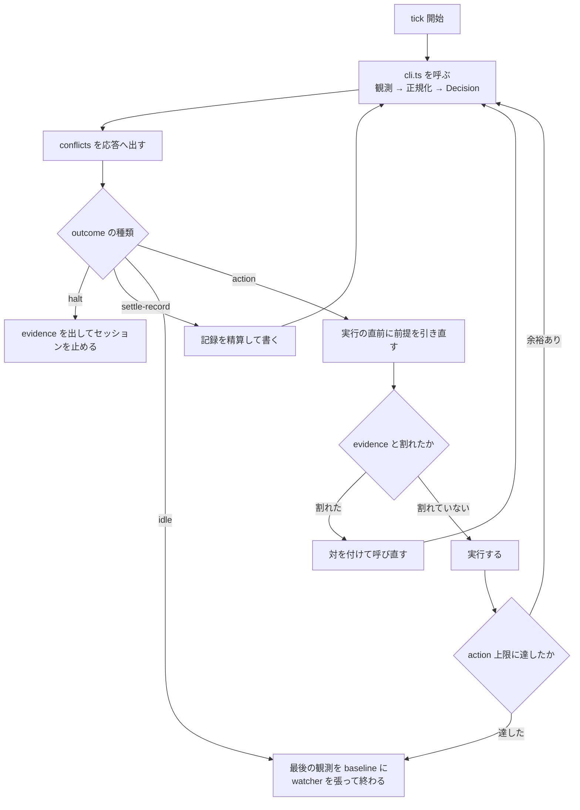

# 自動消化ループ

目的は課題を滞りなく流すこと。指標は速さではなく詰まりの少なさ。迷ったら「どちらが待ち行列を短くするか」で決める。

有限状態機械の reconciler。外部化された状態を観測し、そこから一意に決まる遷移だけを実行する。技術方針・製品優先順位・課題の中身には立ち入ら**ない**（`resolve` の領分）。

常駐して tick を繰り返す。tick は冪等で、前回の続きを仮定しない。自分の記憶を状態に**しない**。

`references/` を毎 tick 読ま**ない**。正規化も発火条件も `cli.ts` が返す。

| いつ                                 | どれ                                                                           |
| ------------------------------------ | ------------------------------------------------------------------------------ |
| action を実行するとき                | `references/protocols.md`（手順）・`references/harness.md`（multiplexer 操作） |
| 規約の穴を起票するとき               | `references/intake.md`                                                         |
| 人が tick の外から何か渡してきたとき | `references/intake.md`                                                         |
| tick の意味論を書き換えるとき        | 下記                                                                           |

意味論を変えるなら、先にテストを変える。期待の SSOT は `test/decide.test.ts` と `test/normalize.test.ts` で、`references/scenarios.md` は同じ行 ID の解説。表だけを直しても何も変わら**ない**。

触る関数の周りだけを読ま**ない**。規則の理由は doc comment にあり、述語の理由は関数の直上、順序と単位の理由は `LADDER` と `Rung` の定義側にある。

| 変えるもの          | 全文を読むファイル                                                                                                                                                                              |
| ------------------- | ----------------------------------------------------------------------------------------------------------------------------------------------------------------------------------------------- |
| 正規化              | `src/normalize.ts` + `references/tick.md`                                                                                                                                                       |
| action の選択・順序 | `src/decide.ts` + `references/tick.md`                                                                                                                                                          |
| 資源の保持・交差    | `src/resources.ts` + `references/resources.md`                                                                                                                                                  |
| 観測の境界          | `src/decode.ts` / `src/observe.ts` / `src/checks.ts` / `scripts/watch.sh` / `scripts/pr-list.jq` / `scripts/restrict-to-board.awk` / `scripts/project-status.graphql` / `scripts/cycle-mark.py` |
| 射程と期待          | `references/scenarios.md` + 対応する `test/*.test.ts`                                                                                                                                           |

自分がやるのは 4 つ**だけ** —— 実行器へ渡す prompt 本文、応答に出す `Conflict` の人向け説明、`intake` の分類、規約の穴の起票。判断が要るのは後ろ 2 つだけ。Decision の `conflicts[]` は `cli.ts` が出す。

実行器へ渡す prompt 本文は、選んだ action のすることから一意に決まる。することの所在は `references/protocols.md`。**表に無い伝達をその場で組み立てない**。

掛かるのは **本文を conductor が作る伝達**だけ。対象セッションは `refine-*` / `resolve-*`。人の答えの転記、振り先への材料渡し、交代の引き継ぎは対象外。

他の工程が所有する記録について、書くか / marker / state / 中身を指定しない。事実を渡し、受け手が自分の述語で再評価することは残る。書き手は各記録の既存記述から引く。所有の一覧は作らない。

project 差分が無くても動く。**例外は Status の対応**で、これだけは project 必須（無ければ fail-closed で止まる）。推測が外れても待ちが伸びるだけの項目には既定値を置き、間違ったものを掴む項目には置か**ない**。

## 受け取らない

人が tick の外から何か渡してきたら、tick より先にここで分類する。

判定は「自分の context が増えるか」の 1 本。増えるなら自分では実行しない（問い合わせ・調査・文書仕事・skill の修正）。着手せずに pane を割って振る。断って終わりに**しない**。振り方は `references/intake.md`。

製品判断は振ら**ない**。人へ返す。振ってよいのは答えが事実で決まるもの（調査・実装・文書・skill の修正）だけ。

人から渡されたものの処理は action では**ない**（転記・指示された Issue の作成・宣言行の記入・指示されたボードの並べ替え・振る）。`1 tick 1 action` にも上限にも数えない。転記のやり方は `references/harness.md`。

自分の観測から出たものの起票は、action として数える（発火は `src/decide.ts` の LADDER）。

Issue の本文で触ってよいのは関係の行**だけ**（宣言と `Refs #N`）。作ってよいのは人が指示したときと、自分の規約の穴だけ。書き方と歯止めは `references/intake.md`。

## 観測

指紋に入る材料は `scripts/watch.sh --snapshot` から読む。取った file は捨てず、tick を終えるときに `--baseline` として渡す。

別に取るのは snapshot に無いもの**だけ** —— Issue 本文、固定 marker のコメント本文、各着地面の統合先に含まれる commit、成果の指紋（`scripts/cycle-mark.py`）。

観測の最初に、各着地面の統合先を fetch する（snapshot が行う）。

一覧は必ず全件取る。先頭 N 件で打ち切ら**ない**（ページングを最後まで回す。上限つきの API は上限に達したこと自体を失敗として扱う）。

読む先はここからのみ。

| 観測材料                 | SSOT                                                                                                                                                                                                        |
| ------------------------ | ----------------------------------------------------------------------------------------------------------------------------------------------------------------------------------------------------------- |
| 自動実行の承認・課題仕様 | Issue 本文 + Status                                                                                                                                                                                         |
| 課題どうしの関係         | Issue 本文の先頭区画・行頭の宣言行（`Depends on` / `Same branch as`。定義は `references/same-branch.md`。本文全体の文字列一致では辿らない）                                                                 |
| 着地面                   | claim 後は claim の記録の `landing`（**欠落は `Conflict`**）。claim 前は Issue 本文の `Lands in`（宣言が無ければ制御面 1 面）。意味論は `references/landing-surface.md`                                     |
| 二重着手防止             | 制御面の remote branch                                                                                                                                                                                      |
| 計画                     | 固定 marker 付きの Issue コメント（形は解決工程の計画。突き合わせは `references/body-digest.md`）                                                                                                           |
| 在庫の鮮度               | 固定 marker 付きの Issue コメント（`references/ready-record.md`）                                                                                                                                           |
| claim                    | 固定 marker 付きの Issue コメント（`references/same-branch.md`）                                                                                                                                            |
| 人待ち                   | 固定 marker 付きの Issue コメント（`references/wait-record.md`）                                                                                                                                            |
| 休止                     | 固定 marker 付きの Issue コメント（`references/protocols.md`）                                                                                                                                              |
| 成果ゼロの周             | 固定 marker 付きの Issue コメント（`references/protocols.md`）                                                                                                                                              |
| 渡した merge の枠        | 固定 marker 付きの Issue コメント（`references/integration-record.md`）                                                                                                                                     |
| 意図の確認               | 固定 marker 付きの Issue コメント（`references/intent-record.md`）                                                                                                                                          |
| 入場を止める宣言         | 固定 marker `entry-block` のコメント（形は `references/issue-contract.md`）                                                                                                                                 |
| 失敗                     | 固定 marker 付きの Issue コメント（`references/protocols.md`）                                                                                                                                              |
| 提出                     | 提出のまとめの記録（置き場と読み方は `references/session-report.md`。**述語をここへ再掲しない**）                                                                                                           |
| 着地                     | PR の `merged` と、各着地面の統合先の SHA（`references/landing-surface.md`）                                                                                                                                |
| 実行器                   | セッション（状態値の意味は `references/harness.md`）                                                                                                                                                        |
| live checkout の姿勢     | 着地面ごとの 現在 branch・dirty・統合先との ahead / behind。課題の状態としては見ない。検査は `merge` skill の fail-closed（`references/landing-surface.md`）                                                |
| 容量                     | 着地面ごとの worktree と、repo 非依存の workspace 一覧（1 回）。数える本数は面の属性と runtime / ledger で絞る（live checkout と本体 checkout は数え**ない**）。`prunable` の述語は `references/harness.md` |
| 台帳                     | Project Status（**排他には使わない**。承認・選出・台帳・退避の制御には使う）                                                                                                                                |

### 正規化

述語の実体は `src/normalize.ts`、期待は `test/normalize.test.ts`。**ここに写さない**。

正規化は Issue 単位で行う。group を 1 レコードに畳ま**ない**。group が単位になるのは選出と資源の集約だけ（claim・在庫・write の数え方）。共有の成果物の帰属は `references/same-branch.md`。

1 件につき 4 つのフィールドへ畳む。`progress` と `runtime` は排他ラダー（上から読んで先に当たった行が勝つ）。`capacity` と `ledger` は値そのものが互いに素。

`Conflict` はラダーで解決できないもの**だけ**。「2 つの行に当たった」は含ま**ない**。一覧は `src/types.ts` の `CONFLICT_REASONS`。立て方は `src/normalize.ts` の `collectConflicts`。**例外は `ledger が期待より先` で、`src/decide.ts` のラダーが立てる。**

`ledger` はこの順で判定する。上から見て最初に当たったところで決まる。

1. `退避先` — 人が見るまで拾わせない安定状態。`ledger` のずれからは `Conflict` にも差し戻しにも**しない**。置き手を数え上げ**ない**。分岐には使わ**ない**
2. 差し戻しの 5 事象のどれか — 戻す
3. 期待どおり — 何もしない
4. 期待より手前 — 前進で直す
5. それ以外（先・解釈不能）— `Conflict`

差し戻しを `Conflict` より先に見る。

コードに無い規約:

- checks の緑は `src/checks.ts` の `classifyChecks`。抽出は `scripts/pr-list.jq`。`mergeStateStatus` で代用し**ない**
- 人待ちの SSOT は Issue の記録であって、multiplexer の印では**ない**。**印と記録が食い違ったら記録が正**。印だけの判定は `src/normalize.ts` の `collectConflicts`
- `計画中` を `progress` に置か**ない**
- 容量を数えるのは `あり` だけ。`prunable` は片付けの対象だが枠は食っていない。branch を `capacity` に入れ**ない**
- 数える本数は group の代表の面。成員では増やさない。live checkout と repo の本体 checkout は数え**ない**
- 人待ちと退避先は数える本数に入れ**ない**。休止は入れる。枠を消費するかは面の属性だけで、変更の中身では決めない

## 1 tick

**判断は自分でしない。`src/cli.ts` が返す `Decision` を実行する**。観測・正規化・action の選択は決定的な純関数で、同じ観測からは必ず同じ結論が出る。**その結論を読み替えない** —— 読み替えると、 `test/decide.test.ts` が守っている意味論と、実際に走るものが別になる。

**例外は 1 つだけ。実行の直前に引き直した前提が `evidence` と食い違ったときは、その action を実行しない。** 観測の欠陥は純関数からは見えないので、**気づけるのは実行する側だけ**。

- **食い違いを実測で示せるときに限る**（観測した値と、それを作っている `file:line`）。示せないなら実行する
- 同じ周で `cli.ts` を `--spec-gap-issue <代表>` `--spec-gap-fact <事実>` 付きで呼び直す。実行しなかった action は上限に数えない。返ってきた `規約の穴を起票する` を `references/intake.md` で実行する。発火は `src/decide.ts` の LADDER
- 同じ事実の open Issue が既にあるなら渡さず、元の action を実行する。起票が終わったら次の呼び出しから外す
- **「この action は良くないと思う」では止めない**。止めてよいのは前提が観測と割れているときだけ

```bash
bun run <skill>/src/cli.ts --config <project 差分 skill の config.json> \
  --snapshot-out <baseline に渡す file> --surface-path <面の名前>=<checkout>... \
  [--spec-gap-issue <代表> --spec-gap-fact <事実>]
```

対で渡す。`<代表>` は実行しなかった action の代表。壊れた渡しは `src/cli.ts` の `specGap` が止める。

設定は JSON で、置き場は **project 差分 skill の `config.json`**。必須項目と検証は `src/config.ts` の `parseConfig` が SSOT で、ここに写さ**ない**（1 つでも欠けたら exit 2 で止まる）。`sessionsCmd` / `workspacesCmd` は省略できる。省略時の中身は `references/harness.md`。project に手で写さ**ない**。

**checkout path は設定に入れない**。端末ごとに違うので、`--surface-path` で面ごとに渡す（座標表の規則は `references/landing-surface.md`）。**宣言された面を 1 つでも渡さなければ exit 2**。



**`conflicts` は `outcome` と直交する**。当たった課題を選出対象外にするだけで、他の課題は回る。
1 件を止める / 全体を止めるの切り分けは「硬い上限」。

| `Decision`      | 何をするか                                                                                                                                                                                                                              |
| --------------- | --------------------------------------------------------------------------------------------------------------------------------------------------------------------------------------------------------------------------------------- |
| `conflicts`     | 触らずに応答へ出す。1 手を選べた周でも出す。出し方は下の「応答に出すもの」                                                                                                                                                              |
| `halt`          | 計画 schema 不明（scenarios のセッション停止）。evidence（Issue 番号・marker・読めない理由）を応答へ出し、**セッションを止める**。action / 精算は走らない                                                                               |
| `action`        | `params` の action を `target.representative` に対して実行する（手順は `references/protocols.md` と `references/harness.md`。規約の穴の起票は `references/intake.md`）。**`evidence` は実行の直前に前提を引き直すため**に持たされている |
| `settle-record` | 記録を精算して書く。**action 上限には数えないが、書いたら `cli.ts` を呼び直す**（記録は指紋に入る）                                                                                                                                     |
| `idle`          | watcher を張って終える                                                                                                                                                                                                                  |

`action` と `settle-record` の精算に要る値は `records`（`currentMark` / `markMatch` / cycle / failure）。`observeTick` を再実行せず、`cycle-mark.py` を手で組まない。形は `src/types.ts` の `TargetRecords`。

### 応答に出すもの

| 条件                                         | 応答へ出すもの                                                                                    |
| -------------------------------------------- | ------------------------------------------------------------------------------------------------- |
| `idle` かつ `conflicts` が直前の tick と同じ | 出さない                                                                                          |
| それ以外                                     | outcome の行。`usage` の 4 数（数える本数 / 実 checkout / 供給 / 供給目標）。`conflicts` があれば |

- 比較の相手は、このセッションで直前に `cli.ts` が返した JSON の `conflicts`
- 相等は畳み後の reason + evidence + issues（順不同）
- action の選択には使わない
- 起動直後の最初の tick は「直前」が無いので、下の段へ倒す

**自分の context の残量を制約として報告しない**。交代の契機は `references/harness.md`「交代」が持つ。

**終了コードで分ける**。`1` は観測に失敗した（**直前に成功した snapshot を渡して watcher を張る**。
取り直して張らない）。`2` は設定が壊れている（報告して止まる）。

**exit 1 で watcher を張らずに終えない** —— 張らずに終えた tick の後には起こし手が居ないので、一時的な API 障害が永久停止に化ける。

1 つ実行したら観測からやり直す。git・GitHub・multiplexer は同時に撮れるスナップショットでは**ない**。

tick の意味論を決める節を書き換えるときは `references/scenarios.md` を先に確認する。

空キューは終了条件では**なく** idle。次の観測まで待つ。

conductor は 1 つ**だけ**動かす。起動したら自分のセッションに固定名を付け（`references/harness.md`）、tick の観測で同名のセッションが自分以外にいたら自分を止めて報告する。名乗るのを飛ばさ**ない**。

人と並走するのは正常。人が Status を動かす・Issue を足す・直接 `resolve` を走らせるのは前提。禁じているのは conductor の action を 2 つの実行器が出すこと**だけ**。

### 数えない失敗

実行環境が操作そのものを拒否した失敗は、retry budget に数え**ない**（`count` を進めず、`lastAction` も書かない）。判定は API へ到達したかどうか —— 応答が返ったなら（4xx / 5xx も含む）通常の失敗、コマンドが起動しない・permission で弾かれて応答が無いなら環境起因。

- action 上限にも数えず、観測もやり直さ**ない**
- 次の tick でも同じ action を選び続ける
- 応答へ出す。**時間切れで解除しない**

失われたセッションへの渡しが観測上の変化を生まなかった失敗は、通常の失敗として 1 回数える。

- 張り直しは同じ周の回復である（手順は `references/harness.md`）
- 張り直し成功をその action の成功にしない
- 張り直し失敗と初回 stall を二重に数え**ない**

### 記録の精算

retry の `count` を 0 に戻すのは 2 つ（形式は `references/protocols.md`）—— action が成功したときと、`ledger` が `退避先` のものを観測したとき（`lastAction` は残す）。
**例外は** `lastAction` が `計画枠の逼迫を伝える` のときで、三拍子が揃う前には `退避先` を観測しても消さない。

「落とす側が一体で精算する」形に**しない**。戻す主体を人に**しない**。どちらも不変条件として書く。

解除条件を発火条件の否定に**しない**。**例外は「伝える」のうち本文変更と計画失効の 2 つだけ**。

| `lastAction`             | 例外の解除条件（現在の観測だけで決める）                          |
| ------------------------ | ----------------------------------------------------------------- |
| 計画セッションを片付ける | `ledger` が `計画済み` 以降で、`refine-<番号>` のセッションが無い |
| 本文の変更を伝える       | その action の発火条件が偽になった                                |
| 計画の失効を伝える       | 同上。**project が足した発火条件も含む**                          |
| 計画枠の逼迫を伝える     | 三拍子が揃った、または人が答えて有効な `waiting` でなくなった     |
| 交差を解消する           | 休止の記録が現在の交差を記述しているか、記録が無くなった          |
| checks を引き直させる    | `progress` が `着地待ち` になった                                 |
| 意図の確認を促す         | 意図の確認の記録が観測できるようになった（3 状態のどれでもよい）  |

本文変更と計画失効の解除条件を述語の実体で書か**ない**。`refine` セッションの不在で共用し**ない**。
計画枠の逼迫の精算は三拍子だけ。人が答えた解除は失敗の `count` 側。枠が一時的に空いただけでは戻さない。

2 時点の比較に**しない**。禁じているのは観測できない過去を使うことで、比較の相手を記録に持つなら当たら**ない**。

実行器を 1 周回して何も出なかった周は、周回の記録が数える（形式と更新の順序は `references/protocols.md`）。失敗の記録とは別。**加算条件をここに写さない。**

### action の優先順

action の名前と順序と発火条件の実体は `src/decide.ts` の `LADDER`、期待は `test/decide.test.ts`。**ここに写さない**。選んだ後の手順は `references/protocols.md`。

同じ課題に 1 tick で 2 つの action を出さ**ない**。上から最初に当たったものを 1 つだけ実行する。「1 tick で」を落とさ**ない**。

適用の単位は group（正規化は Issue 単位、実体を触る action は代表の番号で 1 回）。帰属・代表の固定・片付けの条件は `references/same-branch.md`。終端が混在する group は `Conflict`。

順序: 止める・消えるものを残す → 終わったものを消す → 台帳のずれを直す → 実行器を動かす → 新しく始める。**規約の穴の起票だけは最上段に近い**（次の tick に観測から復元できない**唯一**の行）。

`ledger` が `退避先` の課題に当てる action は、`src/decide.ts` の `isShelved` が外している rung だけ。判定は Status の値だけで行う。

コードに無い規約:

- 起こす・渡す・閉じる action は、結果を観測してから tick を終える。**観測できなければ失敗として扱う**（無言で次へ行かない）
- `待機` / `休止` に落ちた課題はすべて「枠を渡す」の受け手。既に write を保持しているかどうかで絞ら**ない**
- 前進と後退を混ぜ**ない**。「台帳を進める」は期待表に向かって進めるだけ、「差し戻す」だけが戻す
- `stale` は独立した概念では**ない**。`progress` から期待される `runtime` / `capacity` / `ledger` とのずれがそれで、別の表を持た**ない**
- 「伝える」3 つは失敗として数える（同じ内容を送っても計画コメントが変わらなければ `count` を進める）
- 計画の人待ちが落ちたときは「計画を起こし直す」が拾う。供給を見**ない**

#### 計画セッションの rename

`idle` では閉じ**ない**。`retired-refine-<番号>` へ rename する。手順は `references/harness.md`「片付ける」。

- rename した番号は、`retired-` が残っているあいだ計画が起きない。その Issue の「計画を起こす」「計画を起こし直す」は塞ぐ。物理枠の述語からは外し、「計画セッションが無い」の判定には含める
- `runtime` には写さ**ない**（`無し` として扱う）
- 塞ぎが解けるのは、人が pane を閉じたとき**だけ**。時間切れでも解か**ない**
- 差し戻しの側では塞がない
- rename は失敗として数え**ない**。`resolve` には rename を適用し**ない**
- `ledger` が `未計画` のまま片付けるなら失敗の記録を進める。**ただし `done` で閉じたときだけ**

### いつ打つか

ポーリングしない。待ちっぱなしにもしない。観測の snapshot を取り、前回と違ったときだけ打つ。

tick を終えるときに、最後の観測の snapshot を `--baseline` として渡して watcher を張る。張るのはここ 1 箇所。

- 渡すのは、その tick が action を決めるのに使った観測。**起床側で取り直さない**
- `--interval` / `--max` は検知の遅延の調整であって、この窓の対策では**ない**（既定は `references/harness.md`）
- 指紋を動かす書き込みをしたら、観測からやり直す。**action に数えない書き込み**（周回・失敗の記録の精算）も含む（上限には数えないまま）
- 指紋に入らない出力は含め**ない**
- 観測できなかった tick も張る。渡すのは直前に成功した snapshot（`--snapshot` は失敗しても既存の file を壊さない）。**取り直さない**
- 張らずに終えてよいのは、一度も観測に成功していないときと、`halt` でセッションを止めるときだけ。前者は渡せる baseline が無い。後者は人が直すまで動かない

指紋に入れるのは、正規化と action が読むものすべての digest。**項目を列挙して数え上げない**。snapshot の節の一覧は `src/decode.ts` の `SECTIONS`、digest は `src/port.ts`。

読むものは「観測」の表がそのまま該当する。**着地面ごとに取る。**

- ローカル branch の tip を落とさない（着地面の branch は push しないので remote 一覧に出ない）
- 面ごとの観測失敗は `-` で残す。**例外は制御面**で、正規化が成り立たないのでラウンドを無効にする
- live checkout の姿勢（dirty・統合先でない branch・分岐）を落とさない

丸めてよいもの。**「観測項目を落とす」のとは違う** —— 項目を落とすと遷移が止まる。

- worktree が prepare を抜けたかは 0 か 1 に丸める。読めなかったときの `-` は 3 つ目の値で、clean へ**畳まない**
- 正規化で同じ値になるものは、指紋でも同じ文字列に畳む。**意味が違うものは畳まない**（`稼働中` と人待ちの手掛かり、セッションの `done` と `idle`）
- 同じ項目を、遷移を駆動しうる部分集合へ絞る。追跡していない PR の checks は `scripts/pr-list.jq`。snapshot の issues は board 上の番号で、`scripts/restrict-to-board.awk`
- 先発判定の 2 段目（作業量）は入れ**ない**。値は action が読む
- 自分の状態は落とし、**存在は残す**（多重起動の判定に要る）

観測対象を絞る軸は「その課題の遷移に効くか」。名前の無い実行器や、どの着地面にも属さない repo の worktree は入れない。**「別 repo だから」で絞らない。**

snapshot の取り方は harness 依存（`references/harness.md`）。

**rate limit でも観測項目を間引かない**。縮退は backoff（間隔を空けて、全項目を取り直す）。

## 資源

並列は「事前に予測した path」ではなく**実行資源の貸し出し**で制御する。論理 lease（write / integration）の保持者は課題、物理枠（容量 / 計画枠）の保持者は実体（`references/resources.md`）。

**保持と交差の述語は `src/resources.ts`、上限は `src/decide.ts` の `TickConfig`。ここに写さない。**

「保持している条件」が唯一の復元式。取得と解放を別に書かない。

**write lease は advisory**。休止を頼む。書き込みそのものは止め**られない**。**correctness を write lease に置かない** —— 直列化を保証するのは integration lease で、そちらは着地の直前に fail-closed で確かめる（`references/integration-record.md`）。

コードに無い規約:

- 計画コメントが無いのに commit か dirty があるなら、証跡の矛盾として報告し、保守的に全交差のまま保持し続ける（非保持へ**倒さない**）
- 本文の不一致で write を手放させない。伝えて着地だけ止める
- `提出中` の write 保持を「書く予定があるか」で条件付け**ない**
- `人待ち` は merge の枠も返す（回収の表）。**`休止` は merge の枠の条件に足さない**
- 記録が `cleared` になった課題・休止の記録を消した課題には、**write を渡し直す**。交差していれば「予定範囲を超えたとき」の後発として休止させる

**容量だけは目安で、超えても止めない**。新しい checkout を伴う action だけ控え、既存の課題を進める action は選び続ける。人待ちと退避先は数える本数に入れない。休止は入れる。

計画枠は人待ちでも返らない。空くのはセッションが消えたか rename されたときだけ（「計画セッションを片付ける」がその行）。

### 交差の判定

判定は 3 値（`src/resources.ts` の `intersect`）。**`unknown` は直列化する。**

資源キーは「同時に触ると壊れるもの」の名前であって path ではない。path は advisory に留める。

**キーの一覧を project が持っていなくてよい**。無ければ全部 `unknown` = 全直列。並列が欲しくなった時点で、実際に衝突した組み合わせから書き足す。

claim するときの交差は `src/decide.ts` の `claimCrossesWriteHolders`。

### merge の枠を渡す・回収する

記録が権限の実体。**先に書き、書けたことを取得して確かめてから伝える**（手順は `references/integration-record.md`）。確かめられなければ伝えない。

次の受け手は claim が最も古い 1 件（同値なら代表の番号が小さい方）。保持者への再送は選定の外。PR 作成の早さで選ば**ない**。占有と壊れ判定は `src/resources.ts` の `integrationOccupied`。

| 事象                             | 扱い                                                                                     |
| -------------------------------- | ---------------------------------------------------------------------------------------- |
| 追随の push で `提出中` へ落ちた | 保持継続                                                                                 |
| セッションが消えた               | 保持継続。起こし直す                                                                     |
| 伝達に失敗した                   | 保持継続。同じ相手へ再送する                                                             |
| 本文が不一致 / 計画が失効        | 保持継続。伝えて着地だけ止める                                                           |
| `runtime` が `人待ち`            | 回収する                                                                                 |
| `ledger` が `退避先`             | **セッションを止めてから**回収する。Status だけでは足りない。止められないなら `Conflict` |
| `着地済み` / `取り下げ`          | 片付けるが回収する（実体を消す手順に含める）                                             |
| 記録が 2 件以上ある・壊れている  | `Conflict`。壊れた記録は全着地面を占める                                                 |

どの回収も、「枠を渡す」より上位の action が旧保持者を止めてから起きる。

### 入場を止める宣言

候補のキーを見ずに止めるのは、既存側だけでこれから来るどの候補とも非互換だと証明できるときだけ。いつ置くかは project の領分、運び方は `references/issue-contract.md` が固定する。

| 宣言を持つ課題が居るあいだ   | 扱い                                           |
| ---------------------------- | ---------------------------------------------- |
| claim                        | **しない**                                     |
| write を渡す（新しく書く側） | 渡さ**ない**                                   |
| write を渡し直す（保持者へ） | 止め**ない**。宣言した課題自身への再貸出も同じ |
| integration を渡す           | 掛から**ない**                                 |
| 既に走っている課題           | 中断し**ない**（自然に終端へ着くのを待つ）     |

効くのは終端に達するまで。外すのは `人待ち` と、セッションを止めたことを確かめた `退避先` だけで、**`休止` は外さない**。

**キーの一覧が無いために全部 `unknown` になっている環境は当たらない**。判定できないことは宣言ではない

置き場は固定 marker のコメント（`references/issue-contract.md`）。**指紋に入らない形に置かない。**

**時間切れで解除しない**。人が直接走らせた課題は止められない。

### 予定範囲を超えたとき

実装中に資源キーが増えるのは異常ではない。規則を固定しておき、その場で判断しない。

1. **先に write を取った側が継続する**。順序の定義はここだけで、他の節は参照する | 段 | 軸 | | --- | ---------------------------------------------------------------------------------- | | 1 | `progress` が進んでいる方 | | 2 | 同値なら、外部化済みの作業量が多い方（全着地面の、統合先から先の commit 数の合計） | | 3 | claim が古い方 | | 4 | 番号 |

2. 休止の記録は conductor が書き、conductor が消す。後発が休止した後に何をするかは解決工程が持つ

**記録は「止まったことを観測してから」効く**（`runtime` の `休止` は記録かつ非稼働）。伝えた時点で非保持にしない。

これは実行資源待ちであって製品判断待ちではない。**人への差し戻しと混ぜない。**

## 硬い上限

暴走は「賢さ」で防がない。外部の数値で止める。**止めるのはここと供給**（容量は目安であって停止条件ではない）。

**既定値は `src/decide.ts` の `DEFAULT_CONFIG`。ここに写さない。**

- 1 tick あたりの最大 action 数。**内容が変わらない報告は数えない**（`Conflict` の報告と「成果が確認できないので片付けない」報告）。観測もやり直さない
- retry budget は**対象集合ごとに数える**（Issue ごとではない）。連続失敗は選出対象外へ退避する。記録の置き場は `references/same-branch.md` の帰属表、形は `references/protocols.md`、数える失敗と数えない失敗の区別は「1 tick」
- 成果ゼロの周の上限も対象集合ごと（記録は `references/protocols.md`）。**retry budget とは別に数える**
- systemic failure の circuit breaker。rate limit・ネットワーク断は backoff
- 解釈不能な状態では fail-closed（進めずに報告する）
- 所有していない worktree / セッションは**削除しない**。自分が作ったものは claim の記録から引く
- **live checkout を編集しない**。行ってよいのは fetch と統合先への merge だけで、dirty も分岐も自動で解消しない（`references/landing-surface.md`）
- worktree を作るのは着地面の linked worktree**だけ**
- Issue の close は「片付ける」の一部。条件は `references/protocols.md` の片付け手順が SSOT。**述語をここに写さない**
- tick の中で Issue を作ら**ない**・Status を計画済みへ進め**ない**。台帳を期待値へ寄せることと差し戻しは行う
- **例外は、ユーザーが直接指示したときと、自分の規約の穴を起票するとき**（後者の発火は `src/decide.ts` の LADDER）
- **1 件を止めるのは「差し戻し」、全体を止めるのは conductor セッション自体の停止**。認証不明・conductor の多重起動・計画 schema 不明・整合失敗の連続は全体 pause に倒す

**人待ちの数に上限を置かない**。縛るのは物理枠（数える本数と計画枠）と供給。

### 差し戻し

Status は claim から着地まで単調に進む。戻すのは 5 事象だけで、**人待ちは含まない**（人待ちは記録で表し、Status は進行中のまま）。判定キーは観測できる条件で固定する。

**5 事象の判定・順序・戻し先の実体は `src/decide.ts` の `revertTarget` と `stockStale`、期待は `test/decide.test.ts`。ここに写さない。**

コードに無い規約:

- **記録の無い `進行中` × `未着手` はどの行にも当たらず、`Conflict` に落ちる**。branch が生えるか人が Status を戻すまで解けない
- 「在庫が陳腐化した」に claim の除外を足さ**ない**。「claim が構造的に止まっていない」が既に claim 済みを除いている
- **戻す単位が Issue なのは「在庫が陳腐化した」だけ**（他の 4 事象は group）
- **差し戻した先が、そのまま期待値と整合する形にする**。`未計画` へ戻すのに branch を残さない
- 永続コメントで期待値を上書きし**ない**（失効条件を持てないので、再 claim 後も古い戻し先が残る）

**「前提が崩れた」を差し戻しの理由にしない**。切り分けるのは届け先のセッションの有無。

| 局面                                  | 扱い                                                                 |
| ------------------------------------- | -------------------------------------------------------------------- |
| claim 後（届け先のセッションがある）  | 「計画の失効を伝える」→ 受け取った側が再 plan する。**差し戻さない** |
| `計画済み` × `未着手`（届け先が無い） | 未計画へ戻す（「在庫が陳腐化した」）                                 |

在庫側には届け先が無いので、action を分ける。判定と後始末は `references/ready-record.md`。

## 選出

起こす候補は 2 種類。どちらを起こすかは action の優先順が決める（1 tick に 1 つだけ）。

| 起こすもの | 対象                                                                                                                                            |
| ---------- | ----------------------------------------------------------------------------------------------------------------------------------------------- |
| `refine`   | Status が**未計画**の open Issue で、その番号の計画セッションが無いもの（`refine-<番号>` / `retired-refine-<番号>` のどちらも「有る」に数える） |
| `resolve`  | Status が**計画済み**の open Issue（下記の条件をすべて満たすもの）                                                                              |

**「選出の条件」は、この節が `resolve` の候補 1 件について真偽を決めるものすべて**。節を足して条件を増やしたら、そこも自動的に含まれる。

**取る順序は条件ではない**（「順序」の並べ方）。1 件では真偽が決まらない。

**Status が唯一の選出軸**。`refine` が Status を未計画から計画済みへ進めることが、着手承認そのもの。

対応表に要るのは 5 つ —— 未計画 / 計画済み / 進行中 / 完了 / **退避先**（retry budget 切れを人が見るまで置く先）。書き手側からも読める場所に置く。

**明示された Status 以外は触らない**（fail-closed）。対応が無ければ何も選出せずに報告して止まる。Status が増えたときも、対応表に載るまでは対象外。

### 供給

**供給が目標に達していたら refine を起こさない**。目標の式は `src/decide.ts` の `usageOf`。

供給量は、完了すれば claim できるようになる group。同じ供給を二重に発注しない。

- 人待ちの `refine` は数え**ない**
- `退避先` の計画済みと、`retired-refine-` が残っているものは数え**ない**
- 自分側の欠け（未計画の成員・依存未解決・契約欠け・着地面が解決できない）は数え**ない**
- 入場停止・容量待ち・write 交差だけでは落とさ**ない**
- 揃っていない group の残りを計画している refine は、完了すれば group 全体が claim できるときだけ 1

**数えるのは group であって Issue ではない**。目標の数値を Issue の数と読まない。

目標は起こすかどうかの判定であって、`refine` / `resolve` 自身の停止条件では**ない**。判定はここでだけ行う。

### resolve に渡す条件

次を**すべて**満たすものだけ（実体は `src/decide.ts` の `selectable`）。

1. Issue が open
2. Status が計画済み
3. まだ claim されていない（下記）
4. Issue 契約が揃っている
5. `Depends on #N` の依存がすべて解消している
6. 着地面が解決できる（宣言された面が project 差分の座標表にあり、group の成員全員で同じ集合。`references/landing-surface.md` と `references/same-branch.md`）

**claim 済みの判定は記録と remote branch**。branch 名には番号が 1 つしか入らないので、記録の `members` と「同じ group の代表が claim されている」も見る（group は `src/decide.ts` の `buildGroups`）。**`alsoResolves` では判定しない**（加入の実体は記録の `members`。`references/same-branch.md`）。

### claim の構造的な停止

在庫の陳腐化を止める条件は `src/decide.ts` の `claimStructurallyBlocked`。**容量は含めない**。

claim の条件を足して在庫を待たせるなら、この関数にも足す（自動では追随しない）。写した列挙を他の節に作らない。

### 同一ブランチ group

Issue 本文の **`Same branch as #N`** で結ばれた集合が group（宣言の定義・代表の決め方・claim 後に引き直さないことは `references/same-branch.md`）。group は 1 単位として claim する —— branch は 1 本、`resolve` には対象集合の全番号を渡す。

- **`alsoResolves` だけでは claim から計画コメント書き込みまでの窓が空く**（`references/same-branch.md`）
- group の一部だけが計画済みなら claim し**ない**
- **group はどこでも 1 と数える**。1 group = 1 計画 = 1 write lease = 1 integration lease。在庫の件数も同じ
- **鮮度だけは group で数えない**（記録は成員ごとに別々に書かれる。`references/ready-record.md`）
- **容量だけは 1 ではない**。数える本数は代表の、枠を消費する面の checkout。実 checkout は別に残す

### 順序

**解消 = 依存先の `progress` が `着地済み`、または Issue が closed かつ `ledger` が `完了`**。選出のフィルタ・在庫の除外・陳腐化の非評価は、すべてこの述語を引く。

- `取り下げ` 単体は解消では**ない**
- `完了` の無い close も解消では**ない**

`Depends on #N` から依存グラフを組み、**他をブロックしている数が多いものを先に取る**。同数ならボード上の並び順。

**数えるのは、解ければ実際に動き出すものだけ**。`ledger` が `退避先` の課題は数えない。

依存は選出のフィルタでもあるが、**それだけに使うと詰まりが残る**。待たせている課題があるなら、それを解く課題が最優先。

**枠を渡す先が複数競合したときも、同じ順序で選ぶ。**

**人が優先順を変えたいときは、Project の並びを動かす**。指示を conductor の記憶にも永続コメントにも置かない。

**未計画のままなら拾われない**のが正しい。

## Issue 契約

**Status が計画済み = 「計画が済んでいる」という宣言**。項目と見出しの字面は `references/issue-contract.md` が SSOT。揃っているかを確認するだけで、欠けていたら着手せず不足項目を挙げて差し戻す（戻し先は「差し戻し」の表）。

## claim

claim = その課題を自分が引き受けたという宣言。判定材料は「選出」。

**remote branch の一意作成が二重着手の最後の防壁**。Status や assignee では排他できない。

branch 名は `{prefix}/{Issue 番号}-{slug}`（prefix の既定は `feat` / `fix` / `chore`）。**この形は変えない**。prefix の集合は project が変えてよい。

**全着地面で同じ名前を使う**（片付けと容量の帰属が名前から引かれる）。

選んだ後の手順は `references/protocols.md`（順序・部分失敗の扱い・base の取り方）。
