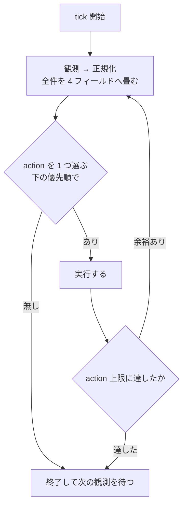

# 自動消化ループ

**目的は課題を滞りなく流すこと**。速く実装することではなく、詰まりを作らないことが指標。判断に迷ったら「どちらが待ち行列を短くするか」で決める。

**有限状態機械の reconciler**。外部化された状態を観測し、そこから一意に決まる遷移だけを実行する。技術方針・製品優先順位・課題の中身には立ち入らない（`resolve` の領分）。

常駐して tick を繰り返す。**tick は冪等で、前回の続きを仮定しない。** 自分の記憶を状態にしない — 落ちても次の tick が観測から組み立て直せることが唯一の要件。

**毎 tick 読むのは本文だけ**。`references/` を読むのは次の 3 つのときに限る。起動時にまとめて先読みしない —— 常駐工程は context が先に枯れるので、先読みすると分けている意味が消える。

| いつ                                       | どれ                                                                                                                                     |
| ------------------------------------------ | ---------------------------------------------------------------------------------------------------------------------------------------- |
| その action を選んだ後                     | `references/protocols.md`（手順）・`references/harness.md`（multiplexer 操作）                                                           |
| 人が tick の外から何か渡してきたとき       | `references/intake.md`                                                                                                                   |
| 本文の条件・既定値・優先順を書き換えるとき | `references/scenarios.md`（期待 action の回帰）・`references/tick.md`（正規化と action の論証）・`references/resources.md`（資源の論証） |

**project 差分が無くても動く**。ここの既定値から外れたときだけ project 側に書く。唯一の例外は Status の対応で、これだけは project 必須（無ければ fail-closed で止まる）。推測が外れても待ちが伸びるだけの項目には既定値を置き、間違ったものを掴む項目には置かない。

## 受け取らない

**人が tick の外から何か渡してきたら、tick より先にここで分類する。**

**判定は「自分の context が増えるか」の 1 本**。増えるなら自分では実行しない —— 問い合わせ・調査・文書仕事・skill の修正がこれ。**着手せずに pane を割って振り、断って終わりにしない** ——断りだけを返すと、人が引き取り先を探す仕事だけが残る。振り方は `references/intake.md`。

**製品判断は振らない。人へ返す**。機能を足す・削る・仕様を変える・優先度を決めるは人の権限で、別のエージェントに渡すと誰も承認していない決定が、承認されたかのように戻ってくる。振ってよいのは答えが事実で決まるもの（調査・実装・文書・skill の修正）だけ。

**人から渡されたものの処理は action ではない**（転記・指示された Issue の作成・宣言行の記入・振る）。`1 tick 1 action` にも上限にも数えない（`退避先` の `count` 精算・状況ボードの更新と同じ扱い）。転記のやり方は `references/harness.md`。

**自分の観測から出たものの起票は、action として数える**（発火条件は「action の優先順」の「規約の穴を起票する」）。Issue 一覧を変えて次の tick の選出に効くので、免除に載せると上限に数えないまま自分で仕事を増やす経路が開く。免除が守っているのは「人が渡した仕事のせいで tick が止まらないこと」であって、conductor 自身が増やすぶんではない。

**Issue の本文で触ってよいのは関係の行だけ**（宣言と `Refs #N`）。**作ってよいのは人が指示したときと、自分の規約の穴だけ** —— 何を課題にするかは製品判断。書き方と歯止めは `references/intake.md`。

## 観測

**観測の最初に default を fetch する**。古い default を基準にすると、着地済みのものを稼働中と数えて枠が埋まったままになる。tick が「前回の続きを仮定しない」のは、ここを毎回やり直すため。

**一覧は必ず全件取る。先頭 N 件で打ち切らない**（ページングを最後まで回す。上限つきの API は上限に達したこと自体を失敗として扱う）。部分観測は禁じ手で、これは rate limit のときだけの話ではない —— 既定の `first: N` をそのまま使うのが最も踏みやすい経路で、返ってきた件数が上限ちょうどかどうかを見ない限り、欠けていることは観測に現れない。実測で、211 件のボードを先頭 100 件しか読まずに在庫と `退避先` の件数を報告していた（選出は上位から順に見るので正しいままで、数え上げだけが静かに狂う。ボードの数字は人が判断に使うので、気づけない誤りになる）。

読む先はここからのみ。

| 観測材料                 | SSOT                                                                                                                                            |
| ------------------------ | ----------------------------------------------------------------------------------------------------------------------------------------------- |
| 自動実行の承認・課題仕様 | Issue 本文 + Status                                                                                                                             |
| 課題どうしの関係         | **Issue 本文の先頭区画・行頭の宣言行**（`Depends on` / `Same branch as`。定義は `references/same-branch.md`。本文全体の文字列一致では辿らない） |
| 二重着手防止             | remote branch                                                                                                                                   |
| 計画                     | 固定 marker 付きの Issue コメント（`resolve` が書く。本文との突き合わせ方は `references/body-digest.md`）                                       |
| 在庫の鮮度               | 固定 marker 付きの Issue コメント（`references/ready-record.md`）                                                                               |
| claim                    | 固定 marker 付きの Issue コメント（`references/same-branch.md`）                                                                                |
| 人待ち                   | 固定 marker 付きの Issue コメント（`references/wait-record.md`）                                                                                |
| 休止                     | 固定 marker 付きの Issue コメント（`references/protocols.md`）                                                                                  |
| 渡した merge の枠        | 固定 marker 付きの Issue コメント（`references/integration-record.md`）                                                                         |
| 意図の確認               | 固定 marker 付きの Issue コメント（`references/intent-record.md`）                                                                              |
| 失敗                     | 固定 marker 付きの Issue コメント（`references/protocols.md`）                                                                                  |
| 着地                     | PR の `merged` と default branch の SHA                                                                                                         |
| 実行器                   | セッション（状態値の意味は `references/harness.md`）                                                                                            |
| 容量                     | worktree                                                                                                                                        |
| 台帳                     | Project Status（**排他には使わない**。承認・選出・台帳・退避の制御には使う）                                                                    |

### 正規化

**正規化は Issue 単位で行う**。group を 1 レコードに畳まない。group が単位になるのは選出と資源の集約だけ（claim・在庫・write の数え方）。

**共有の成果物をどう帰属させるかは `references/same-branch.md`**。そのまま引くと非代表が永久に `未着手` になる。

**1 件につき 4 つのフィールドへ畳む**。`progress` と `runtime` は排他ラダー（上から読んで先に当たった行が勝つ）で、生の条件は重なってよい — 重なりは順序が解決する。`capacity` と `ledger` は値そのものが互いに素。

**`Conflict` はラダーで解決できないものだけ**。次のものに限る。「2 つの行に当たった」は含まない。

- **観測できない**（API が落ちて PR の状態が読めない等）
- **証跡が矛盾している**（印はあるのに記録が無い等）
- **`ledger` が下のラダーで 5 に落ちた**（`準備中` なのに `完了` 等）
- **group の中で終端と非終端が混在している**（共有実体をどちらに倒しても壊れる）
- **Issue 契約が欠けているのに、捨てられない成果物がある**（commit または dirty）。差し戻すと実装が消え、放置すると着手できない
- **計画コメントが無いのに実装の証跡がある**（commit または dirty）。資源キーが観測できないまま書いている状態で、保守的に全交差のまま保持し続ける（下記）
- **意図の確認が `pending` なのに、人待ちの記録が `cleared` か無い**。待つのをやめたのに要求が残っている形で、放置すると実物を見せないまま着地する

**`ledger` はこの順で判定する**。上から見て最初に当たったところで決まる。

1. **`退避先`** — 人が見るまで拾わせない安定状態。`ledger` のずれからは `Conflict` にも差し戻しにもしない（観測不能・group の終端混在は別軸なので当たる）。**置き手を数え上げない**。判別が要るなら「失敗の記録を持つのは retry budget 切れで落としたものだけ」という述語で引く
2. **差し戻しの 4 事象のどれか** — 戻す
3. **期待どおり** — 何もしない
4. **期待より手前** — 前進で直す
5. **それ以外（先・解釈不能）** — `Conflict`

**差し戻しを `Conflict` より先に見る**（claim 直後に Status 更新が失敗した`準備中 × 計画済み` は 4 で直る）。

**`progress` — 成果物がどこまで進んだか**。セッションを見ない。上から読み、最初に当たった行が値（各行は上の行に当たらないことを前提にする）。順序は恣意ではなく包含関係 — 終端の証跡があるなら中間状態は過ぎている。

| 値         | 条件（上の行に当たらないこと）                                                        |
| ---------- | ------------------------------------------------------------------------------------- |
| `着地済み` | PR が `merged`、または branch の**空でない** commit がすべて default に含まれる       |
| `取り下げ` | Issue が closed、または **open PR が無く** head に紐づく最新 PR が unmerged で closed |
| `着地待ち` | open PR あり・checks 緑                                                               |
| `提出中`   | open PR あり                                                                          |
| `実装中`   | branch あり・**commit があるか worktree が dirty**                                    |
| `準備済み` | branch あり・計画コメントあり                                                         |
| `準備中`   | branch あり                                                                           |
| `未着手`   | 上のどれでもない                                                                      |

**終端（`着地済み` / `取り下げ`）を最上段に置く。worktree の「有無」は見ず、中身（dirty）だけ見る。**

**checks の緑は `gh pr checks` の判定を使う。JSON を自前で畳まない**（畳む必要があるときは `conclusion // state` で引く。`scripts/watch.sh` が既にこの形）。**`mergeStateStatus` で代用しない。**

**着地は PR の `merged` で見る**。PR を経由しない着地だけ、**空でない** commit の包含で補う。

**`計画中` を `progress` に置かない**（計画セッションの有無は実行器の話で、成果物は進んでいない）。

**`runtime` — 実行器がどうなっているか**。同じく上から読む。

| 値       | 条件（上の行に当たらないこと）                                                          |
| -------- | --------------------------------------------------------------------------------------- |
| `人待ち` | 人待ちの記録が `waiting` **で、それが人待ちを表している**（セッションの有無を問わない） |
| `稼働中` | セッションが動いている                                                                  |
| `休止`   | **休止の記録があり、かつセッションが動いていない**                                      |
| `待機`   | セッションはあるが動いていない（記録が無い / `cleared` のどちらも）                     |
| `無し`   | セッションが無い                                                                        |

**`人待ち` を最上段に置き、セッションの有無を条件に入れない。**

**`waiting` を無条件に `人待ち` へ写さない**。有効かどうかの判定は `references/wait-record.md`「記録が有効かどうか」が SSOT で、**判定できないものは `Conflict`**（証跡が矛盾している）。中身の解釈ではない —— 見るのは質問の本文の有無と、実行資源待ちの証跡の有無だけ。

**セッションの生の状態が「分類できない」を返したら `Conflict`（観測できない）へ写す。**
`稼働中` にも `待機` にも丸めない。値の一覧と意味は `references/harness.md`。

**`休止` は「記録あり」だけでは成立しない**。記録を書いた直後はまだ書き続けているので、ラダー上は `稼働中`（= write を保持したまま）。**この「休止要求中」を `休止` に丸めない。**

**人待ちの SSOT は Issue の記録**であって、multiplexer の印ではない。**印と記録が食い違ったら記録が正**（印だけがあるときは `Conflict`）。

**`capacity` — 実体を持っているか。**

| 値         | 条件                                                       |
| ---------- | ---------------------------------------------------------- |
| `あり`     | worktree の checkout がある                                |
| `prunable` | checkout は無いが、**所有している workspace が残っている** |
| `無し`     | どちらも無い                                               |

容量を数えるのは `あり` だけ。`prunable` は片付けの対象ではあるが枠は食っていない。**branch を `capacity` に入れない。**

**`ledger` — Project Status**。`未計画` / `計画済み` / `進行中` / `完了` / `退避先`。対応表は project 必須。

| `progress`           | 期待する `ledger`                                                                     |
| -------------------- | ------------------------------------------------------------------------------------- |
| `未着手`             | `未計画` **または** `計画済み`（計画が済んで claim 前なら後者。どちらもずれではない） |
| `準備中`〜`着地待ち` | `進行中`                                                                              |
| `着地済み`           | `完了`                                                                                |
| `取り下げ`           | 触らない（人が置いた状態を尊重する）                                                  |

## 1 tick

**1 つ実行したら観測からやり直す**。git・GitHub・multiplexer は同時に撮れるスナップショットではないので、同じ観測に複数の変更を続けて適用すると別の競合を作る。

**この節・優先順・正規化・資源を書き換えるときは `references/scenarios.md` を先に確認する。** 代表シナリオの期待 action が変わるなら意味論を変えている。

空キューは**終了条件ではなく idle**。次の観測まで待つ。

**conductor は 1 つだけ動かす**。起動したら自分のセッションに固定名を付け（`references/harness.md`）、tick の観測で同名のセッションが自分以外にいたら自分を止めて報告する。名前が付いていないと検知できないので、名乗るのを飛ばさない。

**理由は lease が「保持」ではなく「観測からの導出」だから**。誰が持つかは条件式で決まり、排他は remote branch の一意作成（claim）1 つにしか無い。同時に撮れないスナップショットを 2 つの実行器が別々に評価すると、同じ枠を別の課題へ同時に渡す・同じ実体を二重に起こす / 消す・integration の 1 件が 2 件に割れる。「1 tick に 1 action、実行したら観測からやり直す」が導出の一貫性を保証しているので、並列にするなら lease を実際に取る仕組み（CAS）から要る。

**人と並走するのは正常**。人が Status を動かす・Issue を足す・直接 `resolve` を走らせるのは既に前提で、conductor は観測して辻褄を合わせる。禁じているのは conductor の action を 2 つの実行器が出すことであって、外から状態が動くこと自体ではない。

**retry の `count` を 0 に戻すのは 2 つ**（形式は `references/protocols.md`）— action が成功したときと、`ledger` が `退避先` のものを観測したとき（`count` が 0 でなければ 0 に揃える。`lastAction` は残す —— 原因は状況ボードが読む）。

**「落とす側が一体で精算する」形にしない**。`退避先` へ落とす主体は 1 つではなく、計画工程も自分で退避先へ移して終えるうえ、Status 更新と記録更新の片方だけが成功しうる。落とし手ごとに精算を書くと、書き漏らした経路が `退避先` × `count` 上限というどの action も当たらない状態を作る（`差し戻す` は `退避先` に当たらず、`計画セッションを片付ける` は自分の `count` 条件で降りるので、入れ物を片付ける主体が居なくなって計画枠が永久に焼ける）。

**戻す主体を人にしない**。Status を動かすのは人だが、人は失敗の記録を書き換えない。「人が戻したときに 0 にする」と書くと実行する主体がどこにも居らず、救出した次の tick で差し戻しの述語（`count` が上限）が新しい失敗を 1 回も要さずに真のまま当たって直帰する。不変条件にすれば、どの経路で落ちても次の観測で揃う。

**1 つ目には例外がある。次の `lastAction` を持つ記録は、action の成功では 0 に戻さない。**

**解除条件を発火条件の否定にしない**。否定形にすると、記録を書いた瞬間か伝えた瞬間に解除され、budget が一度も積まれないか、`count` が 0 と 1 を往復して上限に永久に届かない。例外は「伝える」2 つだけ（下表。そこは発火条件の否定でよい）。

| `lastAction`                    | 例外の解除条件（現在の観測だけで決める）                                                                                                                                                                                                                                                                                             |
| ------------------------------- | ------------------------------------------------------------------------------------------------------------------------------------------------------------------------------------------------------------------------------------------------------------------------------------------------------------------------------------ |
| 計画セッションを片付ける        | `ledger` が `計画済み` 以降で、`refine-<番号>` のセッションが無い                                                                                                                                                                                                                                                                    |
| 本文の変更を伝える              | **その action の発火条件が偽になった**（条件は「action の優先順」の表）                                                                                                                                                                                                                                                              |
| 計画の失効を伝える              | 同上。**project が足した発火条件も含む**                                                                                                                                                                                                                                                                                             |
| 交差を解消する / 休止を促し直す | **その課題の `runtime` が `休止` になった**（記録があり、かつ止まった）か、休止の記録が無くなった。記録が消える経路も入れる —— 「失効した記録を片付ける」で消えると一度も `休止` にならないので、前半だけでは `count` が残り、次の 1 回の失敗で誤って `退避先` へ落ちる。2 つは同じ記録を伸ばす（`lastAction` は「交差を解消する」） |
| checks を引き直させる           | **`progress` が `着地待ち` になった**                                                                                                                                                                                                                                                                                                |
| 意図の確認を促す                | **意図の確認の記録が観測できるようになった**（3 状態のどれでもよい。`pending` も含む —— 確認が始まったなら促す理由は消えている）                                                                                                                                                                                                     |

**どれも「成功することが計上の理由」なので、除かないと書いた同じ tick で消える**。伝える 2 つを例外に入れ忘れると、送信は必ず成功するので 上限に到達せず永久に `退避先` へ落ちない（数えている意味が無くなる）。

**伝える 2 つの解除条件を述語の実体で書かない**。発火条件の否定でなくなった瞬間に 3 つ壊れる ——project が足した発火条件（未知キー等）では解除条件が常に真になって永久に budget へ届かず、group では「どれかが不一致」で発火するのに「一致した」で解除して往復し、同じ述語を `references/protocols.md` にも書くと片方だけ直ってずれる。

**解除条件を `refine` セッションの不在で共用しない**。伝える 2 つの相手は `resolve` セッションなので、その述語には一生当たらない。逆に、正常に再 plan した課題の `count` が上限のまま居座り、次の 1 回の失敗で誤って `退避先` へ落ちる。

**2 時点の比較にしない** —— tick は前回の続きを仮定しないので、「前は `未計画` だった」を判定に使うと構造的に発火しない。前進すれば次の tick で解除条件が成立して自己修復し、直っていなければ成立しないので戻らない。

**2 つ目（`退避先` の観測）に例外は掛からない。**

**`退避先` の `count` を 0 に揃えるのと、状況ボードの更新判定は、tick のうち action の選択とは独立に行う**（どちらも遷移ではないので action 上限に数えない）。

**action として書かない**。`退避先` にはどの action も当たらないことがあるので、action にすると `PICK → 無し → END` に落ちて一度も揃わない —— 人が救出した瞬間に差し戻しの述語が真のまま当たり、直帰する。

### action の優先順

**同じ課題に 1 tick で 2 つの action を出さない**。上から最初に当たったものを 1 つだけ実行する（片付けるなら起こさない、が自動的に守られる）。「1 tick で」を落とさない —— これが無いと、解消しない `Conflict` の報告が同じ tick の中で当たり続け、tick が終わらない。

**適用の単位は group**（正規化は Issue 単位、実体を触る action は代表の番号で 1 回）。帰属・代表の固定・片付けの条件は `references/same-branch.md`。終端が混在する group は `Conflict` にして人へ返す。

**順序の理由**: 止める・消えるものを残す（1・1b）→ 終わったものを消す（2-3）→ 台帳のずれを直す（4-7）→ 実行器を動かす（8-11）→ 新しく始める（12-13）。終わったものの片付けが台帳の前進より先なのは、`着地済み` で台帳が手前でも、実体を残したまま台帳だけ進めると次の tick で同じ判定を繰り返すため。始める action を最後に置くのは、詰まりを解消してから新規を入れるため。**規約の穴の起票を最上段に近づけるのは、それだけが次の tick に観測から復元できないから** ——他の行はどれも実体か記録から引き直せるが、穴は tick が終わると消える。

| 順  | action                       | 条件                                                                                                                                                                                                                                                                                                                                                                                                                                                                                                                                                                                                                 | すること                                                                                                                                                                                                                                                                                                            |
| --- | ---------------------------- | -------------------------------------------------------------------------------------------------------------------------------------------------------------------------------------------------------------------------------------------------------------------------------------------------------------------------------------------------------------------------------------------------------------------------------------------------------------------------------------------------------------------------------------------------------------------------------------------------------------------- | ------------------------------------------------------------------------------------------------------------------------------------------------------------------------------------------------------------------------------------------------------------------------------------------------------------------- |
| 1   | **報告して止める**           | `Conflict`                                                                                                                                                                                                                                                                                                                                                                                                                                                                                                                                                                                                           | 触らずに状況ボードの「制約・異常」へ出す（fail-closed）                                                                                                                                                                                                                                                             |
| 1b  | **規約の穴を起票する**       | **この tick で、自分が読んでいる skill の記述の誤り・欠落・矛盾のせいで action が誤発火したか、規約を曲げる判断をした**（「読んでいて気になった」では当たらない）。**かつ同じ事実の open Issue が無い**                                                                                                                                                                                                                                                                                                                                                                                                              | 観測した事実だけを Issue にする（**1 tick 1 件**。書き方と歯止めは `references/intake.md`）。並べ替えが要ることを状況ボードへ出す                                                                                                                                                                                   |
| 2   | **片付ける**                 | `progress` が `着地済み` / `取り下げ`、**かつ**（`capacity` が `あり` / `prunable` または セッションが残っている または 人待ちの記録が `waiting` または 渡しの記録が残っている）                                                                                                                                                                                                                                                                                                                                                                                                                                     | 成果を確認してから実体を消し、記録を閉じる（手順は `references/protocols.md`。**成果の確認を飛ばさない**）                                                                                                                                                                                                          |
| 3   | **計画セッションを片付ける** | `refine-<番号>` のセッションがあり、`runtime` が `人待ち` でなく、`ledger` が `未計画` でないか**そのセッションが動いていない**。かつ `ledger` が `未計画` なら失敗の記録の `count` が上限に達していない                                                                                                                                                                                                                                                                                                                                                                                                             | **`done` なら入れ物を閉じ、`idle` なら `retired-refine-<番号>` へ rename する**（どちらも計画枠を空ける。下記）。`ledger` が `未計画` のまま片付けるなら失敗の記録を進める（下記）                                                                                                                                  |
| 4   | **差し戻す**                 | 下の「差し戻し」の 4 事象のどれかに当たる                                                                                                                                                                                                                                                                                                                                                                                                                                                                                                                                                                            | **先にセッションを止め**（在庫の陳腐化には止める実行器が無い）、表の戻し先へ移し、経緯を Issue にコメントする。止めたことを確かめてから、渡しの記録があれば消す                                                                                                                                                     |
| 5   | **本文の変更を伝える**       | 対象集合のどれかの本文が計画の記録と違う。**かつ届け先のセッションが生きていて、`runtime` が `人待ち` でも `休止` でもない**                                                                                                                                                                                                                                                                                                                                                                                                                                                                                         | 再承認と再 plan が要ることを伝える（`references/protocols.md`）。**計画側が更新されるまで着地を止める**（止めるのは受け手の側の停止条件。渡しの記録は消さない。理由は「資源」）                                                                                                                                     |
| 6   | **計画の失効を伝える**       | `baseSha..default` が計画の `invalidationScope` か `resourceKeys` に交差し、**届け先のセッションが生きていて、`runtime` が `人待ち` でも `休止` でもない**                                                                                                                                                                                                                                                                                                                                                                                                                                                           | 再 plan が要ることを伝える（`references/protocols.md`）                                                                                                                                                                                                                                                             |
| 7   | **台帳を進める**             | `ledger` が期待より**手前**、または対象集合の誰かの Status か assignee が欠けている                                                                                                                                                                                                                                                                                                                                                                                                                                                                                                                                  | Status と assignee を期待値へ寄せる（**前進のみ**。後退は「差し戻す」だけが行う）。claim の部分失敗はここで埋まる                                                                                                                                                                                                   |
| 8   | **計画を起こし直す**         | `ledger` が `未計画` かつ `runtime` が `人待ち`（記録が `waiting`）で、計画セッションが無い。かつ **計画枠に空きがある**                                                                                                                                                                                                                                                                                                                                                                                                                                                                                             | 入れ物だけ作って起こす（worktree は使わない）                                                                                                                                                                                                                                                                       |
| 9   | **解決を起こし直す**         | `progress` が `準備中`〜`着地待ち` かつ、`runtime` が `無し` / `人待ち` / `休止` でセッションが無い（**`休止` でも起こす** —— 起こされた側は記録を読んで書き始めないので、実体が観測できるようになるだけ）。かつ対象集合の台帳が揃っている（揃っていなければ「台帳を進める」が先）。checkout が無く、作ると容量が目安を超えるなら選ばない —— ただしその課題が論理 lease を保持しているなら、目安を超えても起こす（新規の claim ではなく保持者の回収。控えると、保持者が容量の解放を待ち、容量を持つ課題が保持者の write 解放を待つ循環になる）                                                                       | checkout があるなら入れ物だけ。無いなら worktree を作ってから起こす                                                                                                                                                                                                                                                 |
| 10a | **失効した記録を片付ける**   | 次のどれか。**①** 休止の記録があるのに、その課題が成果物の側の条件で write を保持していない（`runtime` / `ledger` の側の理由では当たらない。下記）。② 人待ちの記録が `waiting` なのに人待ちを表していない（判定は `references/wait-record.md`「記録が有効かどうか」）。③ 渡しの記録があるのに、「資源」の回収の表の行に当たり、その行が定める観測が済んでいる。3 つは箱が同じだけで、述語は共有しない                                                                                                                                                                                                                | ① と ③ は記録を消し、② は `cleared` にする。**再開は伝えない** —— 渡すかどうかは 11 が別に決める。③ で何を観測してから消すかは行ごとに違う（回収の表がそれぞれ定める。全行共通の追加条件を置かない —— `人待ち` 行に旧保持者の停止を求めると、その課題からは永久に回収できず merge の枠が空かない）                  |
| 10  | **交差を解消する**           | 資源キーが交差する write 保持者が 2 つ以上居て、**そのうち休止の記録を持つものが 1 つも無い**                                                                                                                                                                                                                                                                                                                                                                                                                                                                                                                        | **後発**（順序の定義は「予定範囲を超えたとき」。ここには写さない）に休止の記録を書いて伝える。先発には何もしない。worktree と変更は保持させる                                                                                                                                                                       |
| 10b | **休止を促し直す**           | 休止の記録があるのに、そのセッションが**動き続けている**                                                                                                                                                                                                                                                                                                                                                                                                                                                                                                                                                             | 同じ休止を再送し、**「交差を解消する」の失敗の記録を伸ばす**（新しい記録を作らない。下記）。止めにいかない —— 後発は安全なチェックポイントまで書き続けてよい。budget を超えれば「差し戻す」が `退避先` へ落とし、`退避先` は論理 lease を返すので先発が進む                                                         |
| 10c | **checks を引き直させる**    | `progress` が `提出中` かつ `runtime` が `待機` かつ、**実行中の checks が 1 つも無い**                                                                                                                                                                                                                                                                                                                                                                                                                                                                                                                              | 「誰も動いていない」という事実だけを伝える（**引き直し方は PR を持つ側に任せる**）                                                                                                                                                                                                                                  |
| 10d | **意図の確認を促す**         | **claim 済み**で `progress` が `提出中` / `着地待ち` かつ `runtime` が `待機` かつ、意図の確認の記録が無いか壊れている（`pending` には当たらない —— そちらは確認が始まっている）                                                                                                                                                                                                                                                                                                                                                                                                                                     | 「記録が観測できない」という事実だけを伝える（**要否の判定も見せ方も課題を持つ側に任せる**）。`not-required` と推測して渡さない。失敗の記録を伸ばす（下記）                                                                                                                                                         |
| 11  | **枠を渡す**                 | `runtime` が `待機` / `休止` かつ、**入場を止める宣言を持つ課題が居るなら、まだ write を保持していない課題へは渡さない**（「資源」。保持者への渡し直しは止めない —— 止めると、既に書いている課題が渡し直しを待ち、宣言した課題がその終端を待って両方止まる）。待っているのが write なら資源キーが write 保持者（対象集合自身は除く）のどれとも交差しない（自身を除かないと、`実装中` で write を保持したまま `待機` に落ちた課題が自分と交差して永久に枠を受け取れない —— 人待ちから復帰する経路がこれ）、integration なら渡しの記録を持っているか、記録がどこにも無くて次の受け手に選ばれている（選び方は「資源」） | **write を渡すときだけ、休止の記録を先に消してから**渡して再開させる（integration では消さない —— 休止は write の交差でしか起きないので、消すと交差が残ったまま両方が書ける）。integration は、渡す前に渡しの記録を書く（記録が権限の実体。逆にすると、伝達が成功して記録が落ちたときに次の tick が別の課題へ渡す） |
| 12  | **計画を起こす**             | `ledger` が `未計画` かつ `progress` が `未着手` かつ**その番号の計画セッションが無く**（`retired-refine-<番号>` も「有る」に数える）、人待ちの記録が `waiting` でない                                                                                                                                                                                                                                                                                                                                                                                                                                               | `refine` を起こす（在庫の上限と計画枠を見る）                                                                                                                                                                                                                                                                       |
| 13  | **claim する**               | 選出の条件をすべて満たす。**かつ作っても容量が目安を超えない**、かつ入場を止める宣言を持つ課題が居ない（どちらも「資源」）                                                                                                                                                                                                                                                                                                                                                                                                                                                                                           | branch を作って起こす（下記）                                                                                                                                                                                                                                                                                       |

**`ledger` が `退避先` の課題に当てるのは、上 3 つ**（報告して止める・片付ける・計画セッションを片付ける）と、「失効した記録を片付ける」の merge の枠の回収だけ。人が見るまで拾わせないための状態なので、差し戻し・起こし直し・台帳の前進のどれで動かしても退避が復活する（一度 `未計画` へ落ちれば、次の tick ではもう `退避先` ではない）。判定は Status の値だけで行う — 経緯コメントは監査用で、分岐の条件にしない。

**`idle` では閉じない。`retired-refine-<番号>` へ rename する**（`idle` には人が入力を書いている最中が含まれ、pane を閉じたら戻せない）。計画枠は完全一致で数えるので、rename した瞬間に枠が返り、人の入力はそのまま残る。**閉じる直前に生値を取り直す** —— 一覧を撮ってから閉じるまでに人がタブを開くと `done` が `idle` に変わる。

**rename した番号は、`retired-` が残っているあいだ計画が起きない**。つまりそれ自体が「人が動かすまでどの工程も起きない」滞留で、`退避先` と同じクラスに属する。

- その Issue の「計画を起こす」「計画を起こし直す」は塞ぐ。物理枠の述語からは外し、「計画セッションが無い」の判定には含める
- **塞ぎが解けるのは、人が pane を閉じたときだけ**（conductor には解く手段が無く、時間切れでも解かない）
- 差し戻しの側では塞がない。出口はボードで、`retired-` が残っている Issue を「人がやること」へ出す —— 何をすれば進むか（= その pane を閉じる）まで書く

**rename は失敗として数えない**（人と会話している最中であって、失敗ではない）。人待ちと同じクラス。**`resolve` には rename を適用しない**（worktree を持つので残すと容量が漏れる。計画工程だけの非対称）。

**`ledger` が `未計画` のまま「計画セッションを片付ける」なら、失敗の記録を進める。**
**「伝える」2 つ（5・6）も同じ形の往復を作るので、同じく失敗として数える** —— 同じ内容を送っても計画コメントが変わらなければ `count` を進める（`lastAction` はその action の名前）。どちらも budget を超えれば「差し戻す」が `退避先` へ落とす。

**計画の人待ちが落ちたときは「計画を起こし直す」が拾う**。再起動は新規の計画ではないので、在庫の上限を見ない。

**解除条件に `runtime` を入れない**。見るのは成果物の側の条件だけで、`runtime` / `ledger` の側の理由（`人待ち` / `休止` / `退避先`）では消さない。

**足してよいかの判定はこれ 1 本** —— 消したことの直接の帰結として発火条件が再び真になるなら足さない。成果物の側で保持から外れた課題は、記録を消しても保持者に戻らないので足してよい。

**起こす・渡す・閉じる action は、結果を観測してから tick を終える**（起こす・渡すなら稼働中になったこと、閉じるならセッションが消えたこと）。**観測できなければ失敗として扱う**（失敗の記録を進め（`references/protocols.md`）、次の tick でやり直す。無言で次へ行かない）。

**上限に達したら順位を譲る**（「計画セッションを片付ける」の条件に `count` を入れてあるのはこのため）。譲れば「差し戻す」が `退避先` へ移し、そこは上 3 つしか当たらないので押し戻されない（止められないなら `Conflict` が拾う）。

**`stale` は独立した概念ではない。**「`progress` から期待される `runtime` / `capacity` / `ledger` とのずれ」がそれで、片付ける・計画セッションを片付ける・差し戻す・台帳を進める がその修復にあたる（計画の通知 2 つは修復ではない）。別の表を持たない。

**前進と後退を混ぜない。**「台帳を進める」は期待表に向かって進めるだけ、「差し戻す」だけが戻す。両方を「期待値へ寄せる」で書くと、同じ観測が「計画済みへ戻す」とも「未計画へ直す」とも読めて一意にならない。

### いつ打つか

**ポーリングしない。待ちっぱなしにもしない**。状態のスナップショットを取り、前回と違ったときだけ打つ。何も変わっていない tick は観測の空振りにしかならず、API の枠だけを焼く。

**入れるのは正規化と action が読むものすべての digest**。項目を列挙して足し忘れると、その観測だけで進む遷移が永久に起きない（checks が緑になっても PR 番号は変わらないので、`提出中` から`着地待ち` へ進まず integration が一生発行されない）。個別に数え上げず、読むもの全部から 1 つの指紋を作る。

読むものは「観測」の表がそのまま該当する — Issue（本文・Status・assignee・open / closed）、remote branch、PR（state・checks）、「観測」の表に挙げた固定 marker の記録すべて、セッション、worktree と workspace、default の SHA。

丸めてよいのは 4 つ。**「観測項目を落とす」のとは違う** — 項目を落とすと遷移が止まる。

- **worktree が prepare を抜けたかは 0 か 1 に丸める**（実装中にファイルが増えるたび起こさないため）
- **正規化で同じ値になるものは、指紋でも同じ文字列に畳む**。逆に意味が違うものは畳まない ——`稼働中` と人待ちの手掛かりは別だし、セッション状態の `done` と `idle` も畳まない（片付け方が違う。畳むと、人が入力を書いている最中の pane を閉じる action が、指紋の上では `done` と区別できないまま起きる）
- **同じ項目を、遷移を駆動しうる部分集合へ絞る**。追跡していない PR（branch 名に Issue 番号を持たないもの）の checks は、紐づく課題が無いので定義上どの `progress` も動かせない ——人が自分のブランチで CI を回すたびに起こされるだけになる（実測で 5 tick 連続の空振り）。項目を落とすのではなく値を丸めているので、PR の open / close は今までどおり指紋に出る。判定を branch 名の形だけで行うこと・判定できないものは残す側（fail-open）へ倒すことは `scripts/watch.sh` が持つ
- **先発判定の 2 段目（作業量）は入れない**。commit が積まれるたびに起きるうえ、量が逆転するたびに先発が入れ替わり、両方が別々の時点で休止を受け取る。順序は交差を検出した tick で 1 度だけ評価すれば足りるので、値そのものは action が読み、指紋には出さない
- **自分だけは状態を落とし、存在は残す**。conductor の状態は応答のたびに変わり、どの遷移も駆動しないので入れると全部ノイズになる —— 落としてよい唯一の例外がこれ。一方で存在まで消すと多重起動が指紋に出ず、「同名のセッションが自分以外にいたら止まる」を snapshot から判定できない

**観測対象を絞る軸は「その課題の遷移に効くか」**。別 repo のセッションや、名前の無い実行器は `runtime` にも容量にも関与しないので入れない（入れると無関係な変化で起きる）。

スナップショットの取り方は harness 依存（`references/harness.md`）。

**rate limit のときも観測項目を間引かない**。部分観測は禁じ手で、落とした項目だけで進む遷移が永久に起きない。正しい縮退は backoff（間隔を空けて、全項目を取り直す）。ただし、「観測できていない」ことを状況ボードに出す — 黙って盲目になると、詰まりが「変化が無い」と区別できなくなる。

## 資源

並列は「事前に予測した path」ではなく**実行資源の貸し出し**で制御する。守るものが違うので 1 語にまとめない —— 論理 lease（write / integration）の保持者は課題、物理枠（容量 / 計画枠）の保持者は実体（理由は `references/resources.md`）。

| 資源            | 何を守るか                         | 保持者     | 保持している条件                                                                                                                             | 同時数                                           |
| --------------- | ---------------------------------- | ---------- | -------------------------------------------------------------------------------------------------------------------------------------------- | ------------------------------------------------ |
| **容量**        | ディスクと build 資源              | worktree   | `capacity` が `あり`                                                                                                                         | **目安 4**（超過可。作ると超えるなら選ばない）   |
| **計画枠**      | 計画セッションの同時数             | セッション | **生存している `refine-<番号>` のセッション**（完全一致。人待ちでも返さない。`retired-refine-<番号>` は数えない）                            | 3                                                |
| **write**       | 同時書き込み。資源キーが交差しない | **課題**   | `progress` が `準備済み` / `実装中` / `提出中` かつ、`runtime` が `人待ち` / `休止` でなく `ledger` が `退避先` でない                       | **数の上限を置かない**（資源キーの交差が決める） |
| **integration** | **merge**。本当の直列化点          | **課題**   | **渡しの記録を持つ 1 件**（記録の存在だけで決まる。`着地待ち` に居なくてよい —— 追随中の `提出中` を含む）。記録が無いあいだは誰も保持しない | **常に 1**（変更不可）                           |

**「保持している条件」が唯一の復元式**。取得と解放を別に書かない — 条件が満たされた瞬間に持ち、外れた瞬間に空く、が観測から一意に決まる形。`提出中` → `着地待ち` で write は空く（merge だけが直列化点なので、そこから先は integration が守る）。

**保持の判定で外してはいけないもの**。どれも非保持へ倒すと「交差する 2 つが同時に書く」に落ちる。

- **`待機` を非保持の条件に使わない**。「渡された直後」と「渡される前」は同じ観測になる。譲る経路は `休止` の 1 本に集約する
- **`準備中` は保持側に入れない**（計画コメントを持たないので必ず `unknown` = 全交差になり、入れると claim した瞬間に全保持者と交差して実効並列が 1 に潰れる）
- **計画コメントが無いのに commit か dirty があるなら、証跡の矛盾として報告し、保守的に全交差のまま保持し続ける**（非保持へ倒さない）
- **本文の不一致で write を手放させない**。伝えて着地だけ止める
- **`提出中` の write 保持を「書く予定があるか」で条件付けない**
- **`runtime` を条件に使うのは、記録に裏付けられた値（`人待ち` / `休止`）だけ**。`待機` と `無し` は成果物（`progress`）で決める

**非保持へ倒すのは記録と台帳で裏の取れる 3 つだけ** —— `人待ち` / `休止` は `progress` を問わず write を返し、`ledger` が `退避先` も返す。

- `人待ち` は merge の枠も返す（回収の表）
- **`休止` を merge の枠の条件に足さない** —— write と integration は別の資源で、足すと merge が止まる

**容量だけは目安で、超えても止めない**。超過は外から起きる（人が直接 `resolve` を走らせた、急ぎで頼まれた）ので fail-closed にしない —— 新しい checkout を伴う action だけ控えて、既存の課題を進める action は選び続け、超過は状況ボードに出す。`退避先` が返すのは論理 lease だけで、容量は占有したまま。

**物理枠は実体そのものを数える**。`capacity` が `あり` の数が容量、生存している `refine-<番号>` のセッション数が計画枠（**完全一致で引く。前方一致にしない**）。計画枠は人待ちでも返らず、空くのはセッションが消えたか rename されたときだけ — 計画セッションを片付ける行が要るのはこのため。

**答えが返っても、そのまま書かせない**。記録が `cleared` になった課題・休止の記録を消した課題には **write を渡し直す**。交差していれば「予定範囲を超えたとき」の後発として休止させる。渡し直さないと、資源キーが交差する 2 つが同時に書く。

### 交差の判定

判定は 3 値。**`unknown` は直列化する**（交差しないと言い切れないものを並列にしない）。

| 判定           | 意味                                        |
| -------------- | ------------------------------------------- |
| `compatible`   | 資源キーが交差しない。並列でよい            |
| `incompatible` | 交差する。後発は待つ                        |
| `unknown`      | 判定できない。**`incompatible` として扱う** |

資源キーは「同時に触ると壊れるもの」の名前であって path ではない。path は advisory に留める（別ファイルでも caller と callee・generator と生成物・schema と consumer は意味的に衝突する）。

**キーの一覧を project が持っていなくてよい**。無ければ全部 `unknown` = 全直列になり、遅いだけで壊れない。並列が欲しくなった時点で、実際に衝突した組み合わせから書き足す。先に網羅しようとすると、使われないキーが並ぶ。

### merge の枠を渡す・回収する

**記録が権限の実体なので、先に書き、書けたことを取得して確かめてから伝える**（手順は `references/integration-record.md`）。**確かめられなければ伝えない。**

**次の受け手の選び方**（記録がどこにも無いときだけ評価する）。次をすべて満たすもののうち、PR 作成が最も早い 1 件。**中身は解釈せず、記録の状態と必須の欄だけを見る。**

1. claim 済み（対象集合と代表が定まっている）
2. `progress` が `着地待ち`（`休止` は足さない）
3. `runtime` が `人待ち` でなく、`ledger` が `退避先` でない
4. 本文が計画の記録と一致している
5. 意図の確認の記録が `confirmed` か `not-required`

| 事象                             | 扱い                                                                                                                                                                                                   |
| -------------------------------- | ------------------------------------------------------------------------------------------------------------------------------------------------------------------------------------------------------ |
| 追随の push で `提出中` へ落ちた | **保持継続**。これが sticky にしている当のもの                                                                                                                                                         |
| セッションが消えた               | **保持継続**。起こし直す（保持者は課題であって実行器ではない）                                                                                                                                         |
| 伝達に失敗した                   | **保持継続**。同じ相手へ再送する                                                                                                                                                                       |
| 本文が不一致 / 計画が失効        | **保持継続**。伝えて着地だけ止める（止めるのは受け手の側の停止条件）                                                                                                                                   |
| `runtime` が `人待ち`            | **回収する**。答えても渡し直されるまで着地しない契約があるので、観測はこれで足りる                                                                                                                     |
| `ledger` が `退避先`             | **セッションを止めてから回収する**（「差し戻す」で移すときはその action が止めている。人が手で動かしたぶんは「失効した記録を片付ける」が止める）。Status だけでは足りない。止められないなら `Conflict` |
| `着地済み` / `取り下げ`          | **片付けるが回収する**（実体を消す手順に含める）                                                                                                                                                       |
| 記録が 2 件以上ある・壊れている  | **`Conflict`**（勝手に 1 つ選ばない）                                                                                                                                                                  |

**どの回収も、「枠を渡す」より上位の action が旧保持者を止めてから起きる**ので、掃除を待つあいだに枠が焼けることはない。

### 入場を止める宣言

**claim の条件に交差を入れない**（候補の `resourceKeys` は計画コメントにしか無く、計画は claim して prepare を走らせた後にできる）。**例外は、候補側の値に依らず結論が決まると project が宣言したときだけ** ——「既存側だけで、これから来るどの候補とも非互換だと証明できる」形。宣言の形は project の領分で、ここでは扱いだけを決める。

| 宣言を持つ課題が居るあいだ   | 扱い                                            |
| ---------------------------- | ----------------------------------------------- |
| claim                        | **しない**                                      |
| write を渡す（新しく書く側） | **渡さない**（まだ write を保持していない課題） |
| write を渡し直す（保持者へ） | **止めない**。宣言した課題自身への再貸出も同じ  |
| 既に走っている課題           | **中断しない**（自然に終端へ着くのを待つ）      |

**効くのは終端に達するまで**。外すのは `人待ち` と、セッションを止めたことを確かめた `退避先` だけで、**`休止` は外さない**。

**単一の課題が証跡の矛盾で全交差保持に落ちているあいだも、宣言と同じに扱う**（「計画コメントが無いのに実装の証跡がある」）。**キーの一覧が無いために全部 `unknown` になっている環境は当たらない** —— 当たると 1 件も claim できない。判定できないことは宣言ではない。

**時間切れで解除しない**。代わりに状況ボードへ出し続ける（誰が止めているか・いつから・何を待っているか・人がどう解除できるか）。**人が直接走らせた課題は止められない** ——lease を待たない variant なので、保証できるのは「自分が新しい課題を投入しない」まで。

### 予定範囲を超えたとき

実装中に資源キーが増えるのは**異常ではない**（周辺改善を同じブランチで直しきる方針の帰結）。規則を固定しておき、その場で判断しない。

1. **先に write を取った側が継続する**。順序の定義はここだけで、他の節は参照する（先発の側と後発の側を別々に書くと、表裏の 2 箇所になって片方だけ直る）

   | 段  | 軸                                                                     |
   | --- | ---------------------------------------------------------------------- |
   | 1   | `progress` が進んでいる方                                              |
   | 2   | 同値なら、**外部化済みの作業量が多い方**（default から先の commit 数） |
   | 3   | claim が古い方                                                         |
   | 4   | 番号                                                                   |

2. **休止の記録は conductor が書き、conductor が消す**。後発が休止した後に何をするかは解決工程が持つ（成果の保持・再開時の再 plan は向こうの手順。ここに写すと片方だけ古くなる）

**記録は「止まったことを観測してから」効く**（`runtime` の `休止` は記録かつ非稼働）。伝えた時点で非保持にすると、後発は安全なチェックポイントまで書き続けているので、write が守っているものそのものが破れる。

これは実行資源待ちであって製品判断待ちではない。**人への差し戻しと混ぜない。**

## 硬い上限

暴走は「賢さ」で防がない。外部の数値で止める。**止めるのはここと「計画済みの在庫」**（容量は目安であって停止条件ではない。理由は「資源」）。

- 1 tick あたりの最大 action 数（既定 5）。**内容が変わらない報告は数えない** —— `Conflict` の報告と「成果が確認できないので片付けない」報告は解消するまで毎 tick 最上位で当たるが、同内容は追記しないので実行しても何も起きない。数えると、この状態が 5 件溜まった時点でキュー全体が停止し、しかもボードは変化しないので停止が人に見えない。観測もやり直さない（何も変わっていないので次の課題の判定にそのまま使える）。やり直すと、解消しない報告 1 件ごとに全項目を 1 周取り直し、共有の GraphQL 枠を焼く
- **対象集合ごとの** retry budget（既定 3。記録の置き場は `references/same-branch.md` の帰属表）。連続失敗は選出対象外へ退避する（記録の形は `references/protocols.md`）。Issue ごとに数えない —— 実体を触る action は代表で 1 回しか出ないので、Issue ごとに積むと 1 回の失敗が成員の数だけ増える
- systemic failure の circuit breaker。rate limit・ネットワーク断は backoff
- **解釈不能な状態では fail-closed**（進めずに報告する）
- 所有していない worktree / セッションは削除しない（**人が手で作ったものを消す事故を止めている唯一の行**。conductor は claim の記録から自分が作ったものを引けるので、引けないものは他人のもの）
- **tick の中で Issue を作らない・Status を計画済みへ進めない**（自己増殖の禁止。キューを回すのが責務で、中身を判断しない）。台帳を期待値へ寄せることと、下の差し戻しは行う。ユーザーが直接指示したときと、自分の規約の穴を起票するときは作ってよい（後者の発火条件は「action の優先順」の `1b`）—— 禁止しているのは「無人のループが自分で製品の仕事を増やし続けること」。気づいたことを状況ボードにしか書けないと、発見がそこで死ぬ（ボードは現在地を映すもので、待ち行列には載らない）
- **1 件を止めるのは下の「差し戻し」、全体を止めるのは conductor セッション自体の停止。** 認証不明・conductor の多重起動・計画 schema 不明・整合失敗の連続は全体 pause に倒す（1 件ずつ退避すると、壊れた前提のまま別の課題を進めてしまう）

**人待ちの数に上限を置かない**。質問を積んでも待ち行列は伸びない — 人待ちは write と integration を返し、`refine` は容量を使わない。計画枠だけは `refine` が生きている間ずっと保持するので、そこは計画枠自身が縛る。数を縛るのは物理枠（容量と計画枠）と在庫で足りており、人待ち専用の上限は同じものを二重に縛るだけで、人が答えている最中に新しい計画が止まる副作用の方が大きい。

### 差し戻し

**Status は claim から着地まで単調に進む**。戻すのは次の 4 つだけで、**人待ちは含まない**（人待ちは記録で表し、Status は進行中のまま）。判定キーは観測できる条件で固定する —そうしないと「台帳を進める」の前進と区別がつかない。

| 何が起きた           | 判定（観測できる述語だけ）                                                                                                                                                                                                     | 戻し先       | あわせてすること                                                      |
| -------------------- | ------------------------------------------------------------------------------------------------------------------------------------------------------------------------------------------------------------------------------ | ------------ | --------------------------------------------------------------------- |
| claim だけ残っていた | `ledger` が `進行中` かつ `progress` が `未着手` かつ **Issue 契約は揃っている**                                                                                                                                               | **計画済み** | **claim の記録を消す**（残すと claim 済みに見えて二度と選出されない） |
| retry budget 切れ    | 失敗の記録の `count` が上限に達した                                                                                                                                                                                            | **退避先**   | **`count` の精算は「1 tick」の規則に従う**                            |
| 計画が無効           | **Issue 契約が欠けている**かつ commit も dirty も無い                                                                                                                                                                          | **未計画**   | **claim の記録を消し、branch と実体を片付ける**                       |
| **在庫が陳腐化した** | `ledger` が `計画済み` かつ `progress` が `未着手` かつ **claim が構造的に止まっていない**（`Depends on` がすべて解消していて、入場を止める宣言も無い）かつ、在庫の記録が陳腐化している（判定は `references/ready-record.md`） | **未計画**   | —（`ready` は次の `refine` が上書きする）                             |

**claim が構造的に止まっているあいだは陳腐化を評価しない**。そういう在庫は最も長く留まる集合なので、そこで毎回評価すると default が `invalidationScope` に交差するたびに未計画へ戻して計画し直すのを止まりが解けるまで繰り返す —— 在庫上限が「積みすぎて古くなる」を防ぐ役目を、除外した集合に対して失っている状態になる。解けた時点で 1 回だけ評価すれば、作り直しは 1 回で済む。入場を止める宣言も同じ扱い（時間切れの解除を持たず、解くのは人だけなので、依存待ちより長い）。

**「前提が崩れた」を差し戻しの理由にしない**。述語になっておらず、そのままでは default の進行による計画の失効と切り分けられない。切り分けるのは届け先のセッションの有無。

| 局面                                  | 扱い                                                                 |
| ------------------------------------- | -------------------------------------------------------------------- |
| claim 後（届け先のセッションがある）  | 「計画の失効を伝える」→ 受け取った側が再 plan する。**差し戻さない** |
| `計画済み` × `未着手`（届け先が無い） | **未計画へ戻す**（上の「在庫が陳腐化した」）                         |

**在庫側に届け先が無いから、action を分ける必要がある**。`計画済み` にはまだセッションが無いので「伝える」が空振りする。判定と後始末は `references/ready-record.md`。

**差し戻した先が、そのまま期待値と整合する形にする**。`未計画` へ戻すのに branch を残すと `progress` が `準備中` のままなので、次の tick で台帳が `進行中` へ押し戻されて堂々巡りになる。永続コメントで期待値を上書きしない — 失効条件を持てないので、再 claim 後も古い戻し先が残る。

## 選出

**起こす候補は 2 種類**。どちらを起こすかは action の優先順が決める（1 tick に 1 つだけ。ここは候補の条件を定義する節で、並行して起こす節ではない）。

| 起こすもの | 対象                                                                                                                                            |
| ---------- | ----------------------------------------------------------------------------------------------------------------------------------------------- |
| `refine`   | Status が**未計画**の open Issue で、その番号の計画セッションが無いもの（`refine-<番号>` / `retired-refine-<番号>` のどちらも「有る」に数える） |
| `resolve`  | Status が**計画済み**の open Issue（下記の条件をすべて満たすもの）                                                                              |

**Status が唯一の選出軸**。`refine` が Status を未計画から計画済みへ進めることが、着手承認そのもの。

対応表に要るのは 5 つ — **未計画 / 計画済み / 進行中 / 完了 / 退避先**（最後は retry budget 切れを人が見るまで置く先）。claim と着地の判定が進行中と完了に依存するので、3 つでは足りない。書き手側からも読める場所に置く（`refine` が計画済みへ進めるので、対応表が conductor 側にしか無いと名前が食い違い、その Issue は誰にも選出されずに沈黙する）。

**明示された Status 以外は触らない**（fail-closed）。対応が無ければ何も選出せずに報告して止まる。「不明なので全部見る」に倒さない — 置き場や参照用に使われている Status を掴む。Status が増えたときも、対応表に載るまでは対象外。

### 計画済みの在庫

計画済みを積みすぎると、default が進むたびに計画が古くなり、着手時の再 plan が常態化する。**上限に達していたら refine を起こさない**（消化を優先する）。既定は容量の目安 + 先読み 1（容量の目安は「資源」の表が SSOT）。

**在庫 = 計画済みの group 数 + 生存している `refine-<番号>` セッション数**（完全一致）。計画済みだけを数えると、計画枠のぶんだけ上限を超えられる（回っている `refine` がそのまま在庫に積み上がるため）。`稼働中` だけに絞らない —— `待機` の `refine` が漏れて同じ穴が開く。

**計画枠と同じ述語ではない**。計画枠は人待ちの `refine` も数える（実行器が居るので返らない）が、在庫は数えない（下記）。揃っていると書くと、どちらの読みでも実装できてしまう。

- **人待ちの `refine` は数えない。**「人待ちの数に上限を置かない」と揃える。人待ちを止めるのは計画枠
- **同じ group を二重に数えない**。既に計画済みの group の残りを計画している `refine` は +1 しない
- **`Depends on` が未解決のものは数えない**（計画済みの group も、それを計画している `refine` も両方）。上限が縛るのは「claim 待ちの計画をどれだけ積むか」で、依存待ちは claim 待ちではない（選出の条件 5 が弾くので、依存が解けるまで絶対に消化されない）。数えると、着手できないものが先読み枠を恒久的に食い、`refine` が止まる。同時に走る `refine` の数は計画枠が別に縛るので、ここを緩めても暴走しない。計画が古くなる心配も在庫の鮮度の記録が見ているので、ここで二重に縛らない

  **依存待ちのために Status を分けない**。`Backlog` → `Ready` を普通に通し、`Ready` に居るあいだ数えないだけにする。こうすると計画は作られた状態で待つので、依存が着地した瞬間に claim できる（分けると、そこから計画を始めることになる）。理由の詳細は「状況ボード」の節

**数えるのは group であって Issue ではない**（単位の定義は「同一ブランチ group」）。上限の数値を Issue の数と読まない — 1 group は複数の Issue を持ちうるうえ、実装中に気づいたものは同じブランチで吸収される。実際に流れている量は上限より多い。

**揃っていない group の残りを計画する refine は、在庫の上限を超えて起こす**。上限の目的は「積みすぎて計画が古くなる」ことの防止で、これは新しい仕事を積むのではなく既に計画済みのものを着手可能にする操作。例外にしないと、計画済みなのに永久に claim できない Issue が残る。

**上限は起こすかどうかの判定であって、`refine` / `resolve` 自身の停止条件ではない。判定はここでだけ行う。**

### resolve に渡す条件

次を**すべて**満たすものだけ。

1. Issue が open
2. Status が計画済み
3. まだ claim されていない（下記）
4. Issue 契約が揃っている
5. `Depends on #N` の依存がすべて解消している

**claim 済みの判定は 4 通りある**。branch 名には番号が 1 つしか入らないので、1 つだけでは漏れる。

- **claim の記録の `members` に含まれている**（最も確実。加入は記録が実体なので、台帳や計画の更新が途中で落ちてもここには残る）
- その Issue 番号の remote branch がある（実体の有無は問わない。**実体が無いものは「起こし直す」が扱う**ので、選出で拾うと二重になる）
- **計画コメントの `alsoResolves` に番号が含まれている**（1 ブランチで複数の Issue を片付けるのは通常運用なので、これを見ないと二重着手になる）。セッションの生死で判定しない —外部化された計画は残るので、セッションが消えた隙に別 branch を claim できてしまう
- **同じ group の代表が claim されている**（下記）

### 同一ブランチ group

Issue 本文の **`Same branch as #N`** で結ばれた集合が group（宣言の定義は `references/same-branch.md`）。group は 1 単位として claim する — branch は 1 本、`resolve` には対象集合の全番号を渡す。代表の決め方と固定（claim 後に引き直さない）は `references/same-branch.md`。

`alsoResolves` だけでは **claim から計画コメント書き込みまでの窓が空く**。その間、同じ group の別 Issue が未 claim に見えて別セッションが起き、1 本で直すはずのものが複数ブランチに割れる。本文の宣言はセッションより先に存在するので、この窓が消える。

**group の一部だけが計画済みなら claim しない**。残りが後から同じブランチへ入れられなくなる。

**group はどこでも 1 と数える**。1 group = 1 計画 = 1 branch = 1 write lease。在庫も容量も同じ（古くなるときもまとめて古くなる）。

### 順序

**解消 = 依存先の `progress` が `着地済み`**。`取り下げ` は解消ではない（前提が消えたなら本文を直すのが先で、存在しない前提の上に実装を始めない）。選出のフィルタ・在庫の除外・陳腐化の非評価は、すべてこの述語を引く。

`Depends on #N` から依存グラフを組み、**他をブロックしている数が多いものを先に取る**。詰まりの原因を先に流すため。同数ならボード上の並び順。

**数えるのは、解ければ実際に動き出すものだけ**。`ledger` が `退避先` の課題は人が動かすまでどの工程も起きないので、依存を解いても動かない —— 数えると詰まりでないものを詰まりとして扱い、ボード順を飛び越えて選ぶ（実測で、退避先 1 件をブロックしているだけの課題がボード 105 位から 1 位を飛ばして選ばれた）。人が並べた順を壊すので、目的と逆に働く。

依存は選出のフィルタでもある（解けていないものは選ばない）が、**それだけに使うと詰まりが残る**。待たせている課題があるなら、それを解く課題が最優先。

**枠を渡す先が複数競合したときも、同じ順序で選ぶ**。選出だけの規則にすると、claim 済みの課題どうしの順番を決める根拠がどこにも無くなり、その場の判断に落ちる。

**人が優先順を変えたいときは、ボードを並べ替えてもらう**。指示を conductor の記憶にも永続コメントにも置かない — tick は前回の続きを仮定しないので記憶は次の tick で消え、コメントは失効条件を持てないので古い優先順が残り続ける。ボードは観測材料そのものなので、並べ替えれば次の tick から自動で効く。

**未計画のままなら拾われない**のが正しい。進め忘れが自動着手にならない側へ倒す。

## Issue 契約

**Status が計画済み = 「計画が済んでいる」という宣言**。項目は `refine` の Issue 契約が SSOT。揃っているかを確認するだけで、欠けていたら着手せず不足項目を挙げて差し戻す（戻し先は「差し戻し」の表）。

## claim

**claim = その課題を自分が引き受けたという宣言**。未 claim なら拾ってよい、claim 済みなら拾わない。判定材料と理由は「選出」の節。

**remote branch の一意作成が二重着手の最後の防壁**（作成成功と conflict を区別できる）。Status や assignee では排他できない — 同時に 2 つが「自分が取った」と書き込めてしまう。

branch 名は `{prefix}/{Issue 番号}-{slug}`（prefix の既定は `feat` / `fix` / `chore`）。**番号を含めるのは claim を機械的に引くため**で、この形は変えない。prefix の集合は project が変えてよい。

**選んだ後の手順は `references/protocols.md`**（順序・部分失敗の扱い・base の取り方）。

## 状況ボード

**1 つの Artifact を更新し続ける**。ユーザーがそれを見れば、今どの worktree で何が起きているかが分かる状態にする。Artifact を作れない harness では、同じ内容を最終応答に出す。

更新するのは**下の表のどれかの行が変わったとき**。盤面の行がどれも変わっていない tick では、鮮度だけ差し替える —— 時刻が毎 tick 前進することが conductor が生きている信号になり、止まったボードと「変化が無いボード」を人が区別できる。条件を項目名で列挙しない —— 行を足すたびに条件も足すことになり、落とした行は変化しても更新されず、人に届かないまま積み上がる（実際に「依存待ち」「退避先の滞留」を足したときに落ちた）。

載せるもの:

| 項目                    | 中身                                                                                                                                                                                                                                                                                                                                                                                                                                                                                                                                                                                                                    | 観測元                                                                                         |
| ----------------------- | ----------------------------------------------------------------------------------------------------------------------------------------------------------------------------------------------------------------------------------------------------------------------------------------------------------------------------------------------------------------------------------------------------------------------------------------------------------------------------------------------------------------------------------------------------------------------------------------------------------------------- | ---------------------------------------------------------------------------------------------- |
| **鮮度**                | **観測した絶対時刻を先頭に置く。「何分前か」は書かない** —— 書いた瞬間は常に ≒0 で、以後は古くなるほど新しく見える（1 時間前のボードが「0 分前」と主張する）。読む側は自分の now と引き算できるので、絶対時刻だけで判定能力は落ちない。tick 番号も default の SHA も「いま」と比べられないので、読む側がボードの中だけで信じてよいか判定できない（古いボードを信じて、着地済みのものを人待ちとして報告した実例がある）                                                                                                                                                                                                  | tick の時刻                                                                                    |
| **人がやること**        | **先頭に束ねる**。述語は 「人が動かすまで、どの工程も起きないもの」全部 で、件数と何を答えれば / 何を動かせば進むかを書く。人は上から読むので、散らすと拾われない。行名で列挙しない —— 列挙すると、後から足した滞留（`retired-refine-<番号>`・入場を止める宣言）が下の行にだけ載り、人には計画枠の数字しか見えない（実測で、`Backlog` 最上段の課題が `retired-` に塞がれて選ばれないことに誰も気づけなかった）                                                                                                                                                                                                          | 下の各行の導出                                                                                 |
| **この tick の action** | 何を選び、**なぜそれを選んだか**。数字の差分だけでは読み取れない（在庫が 6 → 1 に減った理由は、これが無いと Issue コメントを開くまで分からない）                                                                                                                                                                                                                                                                                                                                                                                                                                                                        | 実行した action                                                                                |
| 稼働中                  | Issue 番号・`progress`・保持している資源・`runtime`。**branch を持つものは、あわせてその実体**（未コミット数 / 未 push の commit 数 / default から何 commit 遅れているか。計画セッションは branch を持たないので出さない）—— `progress` は意図であって実体ではなく、失われうる作業量と追随コストがどこにも出ない。実測で、未コミット 24・push 0・default −344 ファイルの課題がボード上は最も健全に見えていた                                                                                                                                                                                                            | 正規化レコードと worktree の git 状態                                                          |
| 待機中                  | 何を待っているか、何が空けば動くか。**`休止` もここに載せる**（何が着地すれば再開できるか。write 非保持だが未コミットは抱えている）                                                                                                                                                                                                                                                                                                                                                                                                                                                                                     | 正規化レコードと容量                                                                           |
| 詰まり                  | 人待ちのもの。**何を答えれば進むか**を 1 行で。記録がいつから `waiting` かも出す（投げたばかりか、返事が遅れているのかで人の動きが変わる）                                                                                                                                                                                                                                                                                                                                                                                                                                                                              | 人待ちの記録の `reason` と、そのコメントの更新時刻                                             |
| 依存待ち                | `Depends on` が未解決のもの。**何が着地すれば動くか**を 1 行で                                                                                                                                                                                                                                                                                                                                                                                                                                                                                                                                                          | Issue 本文の `Depends on` と依存先の `progress`（解消の定義は「選出」）                        |
| 退避先の滞留            | 件数と番号。人がここを見て未計画へ移すまで、**どの工程も起きない**（`refine` / `resolve` を起こす action が当たらない）                                                                                                                                                                                                                                                                                                                                                                                                                                                                                                 | `ledger` が `退避先` の Issue                                                                  |
| 制約・異常              | `Conflict` の内容、容量が目安を超えていること、そのために選ばなかった action、**GitHub 観測不能・backoff 中**であること、`退避先` へ落ちた課題と原因の `lastAction`（retry budget 切れで落ちたものだけ。人が置いたものには記録が無い）、宣言に見えるのに読まれない出現（下記）、この tick で自分の規約を曲げたこと・規約の穴に気づいたこと（下記）、渡しの記録があるのに merge が進んでいないこと（保持者が `待機` / `人待ち` / `退避先` に居ると、他のどの行にも出ない）、入場を止める宣言があること（誰が・いつから・何を待っているか・人がどう解除できるか。時間切れの自動解除を置いていないので、これが唯一の出口） | 正規化レコードと容量、起床スナップショットの観測結果、失敗の記録、Issue 本文、この tick の実行 |
| 直近の着地              | 前の tick 以降に default へ入ったものと、**そのセッションまとめの `積み残し・懸念`**（`対応不要` の推奨が付いていても落とさない）。人が読んで次のアクションを決める材料で、worktree を消すと PR のコメントにしか残らない                                                                                                                                                                                                                                                                                                                                                                                                | default の SHA 差分と、PR に載ったセッションまとめ                                             |
| キュー                  | 計画済みの残数と次に取る予定の上位数件                                                                                                                                                                                                                                                                                                                                                                                                                                                                                                                                                                                  | Issue 一覧                                                                                     |
| 表に載らない滞留        | **振った作業**（どこへ何を渡したか）、`retired-refine-<番号>` が残っている Issue、この tick で起票した Issue（下記）                                                                                                                                                                                                                                                                                                                                                                                                                                                                                                    | この tick の実行、セッション一覧、Issue 一覧                                                   |

**表に載らない滞留を行にするのは、どれも「異常が起きた」形では現れないから**。振った作業は action にも数えないので「この tick の action」も動かず、`retired-refine-<番号>` は人が pane を閉じるまで再計画されず、起票した Issue は人がボードを並べ替えるまで選ばれない。行にしないと更新の契機にも掛からず、黙って止まる。どこへ置くべきかは書かない —— 優先順は製品判断で、conductor の領分ではない。自分でボードを並べ替えない（人が並べた順を上書きすることになり、ボードが観測材料であることが壊れる）。

**宣言に見えるのに読まれない出現を出すのは、黙って消えるのがいちばん重いから**。先頭区画の外にある `Depends on #N` / `Same branch as #N` の一致は関係として読まれないので、書いた側は宣言したつもりで、読む側には存在しない —— 依存が解けていないのに claim され、group が 2 本のブランチに割れる。どちらも「異常が起きた」形では現れないので、検知しなければ誰も気づけない。行頭かどうかで絞らない（理由は `references/same-branch.md`）。自分で直しにいかない ——本文を書き換えると digest が動いて計画を陳腐化させるので、人へ出すだけにする。

**自分の逸脱を出すのは、pane を読まないと取れないから**。規約を曲げた判断は妥当なこともあるが、妥当かどうかを決めるのは人で、応答に書くだけでは流れて消える。穴に気づいたのに直せない（自分の領分でない）ものも同じ。

**その tick で起きたことだけ書く**。tick は前回の続きを仮定しないので、過去の逸脱は観測材料が無く再現できない（「3 tick 前に曲げた」は記憶にしか無い）。持ち越したいなら外部化する側の問題で、ボードで解く話ではない。

**退避先を出すのは、そこが人の受信箱だから**。解決工程は製品判断を含む懸念を退避先の Issue にする（`resolve` の「着地の段階で残ったものの行き先」）。放っておくと静かに積み上がり、置き場が変わっただけで忘れられ方は変わらない。滞留を出せば、人が見て未計画へ移した時点から先は自動で流れる。

**依存待ちを Status のレーンにしない**。新しい Status は `ledger` の 5 値のどれかへ写す必要があり、`退避先` に写せば人が戻すまで止まり、`未計画` に写せば既にある計画を捨てる —— どちらも壊れる。そのうえ `Depends on` と二重管理になり、依存が解けてもレーンは動かないのでボードが人に嘘をつく。依存待ちは観測から導出してここに出すだけにする。

**経過時間を出すのは、観測できるものだけ**。人待ちは記録コメントの更新時刻があるので出せるが、`待機` になってからの時間と `退避先` に落ちてからの時間は観測材料が無い（セッション一覧も Status も変更時刻を返さない）。観測できない値を項目に書かない —— 埋めようとした tick が毎回コストの高い経路へ逸れる。

**URL は記憶しない。題名を固定し、一覧から引き当てる**（無ければ新規に作る。題名の条件は `references/artifact.md`）。tick は前回の続きを仮定しないので、覚えた URL は次の tick には正しい保証が無い記憶になる。それでも掴むと、作り直された版を見失って古い方を更新し続ける —— 人が一覧から開くのは新しい方なので、更新しているのに盤面が止まって見える（読むときも同じ理由で題名から引き当てる）。tick ごとに新しい Artifact を作らない。

**課題の枚の URL も添える**。Issue 番号を出す行に、その課題の本文の先頭区画にある URL を置く（本文は既に読んでいるので観測は増えない）。行が無ければ出さない —— 題名から引き当てにいくと観測が増える。着手後は本文へ書き足せない規約なので、行が無い課題はそのまま欠ける。計画工程は人の画面に出ないことがあり、そのときはボードが人の唯一の入口になる —— 出さなければ、計画も判断の根拠も誰にも読まれない。課題の枚は読むだけで、書き換えない（ボードを書くのは tick、課題の枚を書くのは工程）。

**書き換えるのは tick だけ**。振った pane も、人へ返す応答の側も、ボードには書き足さない。次の tick が全面的に書き直すので、書き足したものは黙って消えるか、消える前に読まれれば由来の違う記述が 1 枚に混ざる —— どちらにせよ、人は自分が読んだ行がまだ生きているのか判定できない。ボードに載らないことを伝えたいなら、Issue コメントか応答に置く。

1 件終わるごとの詳細な報告は `resolve` のセッションまとめが担う。ここは全体の現在地だけを持つ。
