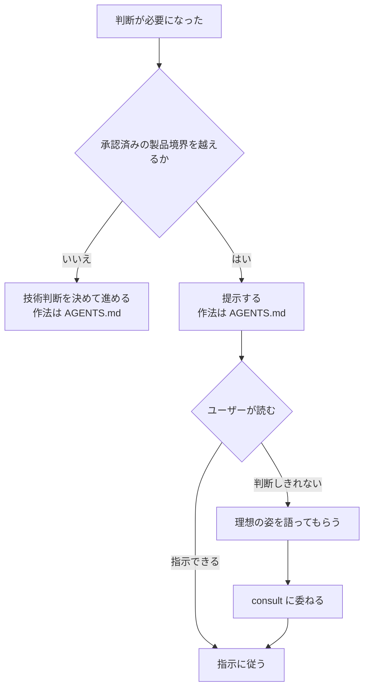

# 判断が要るとき

判断の分担は `~/.agents/AGENTS.md` に従う。Issue 本文に無いという理由だけでは止めない。
承認済みの製品境界を越える判断は、`../SKILL.md` の停止条件に従ってユーザーへ確認する。それ以外はエージェントが決める。

提示の作法は `~/.agents/AGENTS.md`。**提示は譜面にする** —— **この課題の譜面を書き直す**（引き当て・節の作り方は `score.md`）。

ユーザーが判断しきれず理想を語ったときは、それを判断材料として `consult` に渡してよい（プロダクト方針はユーザー・技術的収束はアドバイザー、という分業の内側）。
